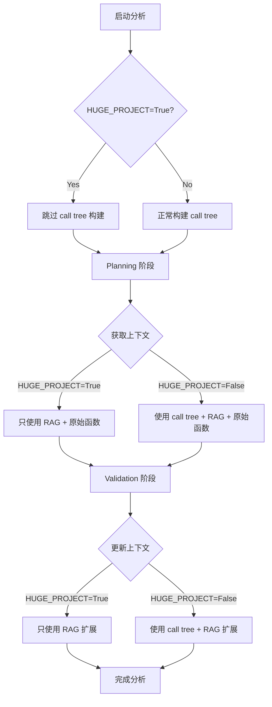

# Huge Project 模式功能说明

## 概述

新增了 `HUGE_PROJECT=true` 环境变量开关，当启用时可以跳过所有 call tree 相关操作，以适配超大项目的分析需求。

## 功能特点

- ✅ **跳过 call tree 构建**：避免大项目中函数关系分析的性能开销
- ✅ **跳过 call tree 上下文获取**：planning 和 validation 阶段都不会获取 call tree 相关上下文
- ✅ **保留 RAG 功能**：仍然可以使用语义相似性搜索获取相关函数
- ✅ **最小化修改**：只修改了3个核心位置，保持代码整洁

## 使用方法

### 环境变量配置

```bash
export HUGE_PROJECT=True
```

或在 `.env` 文件中添加：

```
HUGE_PROJECT=True
```

### 适用场景

- 函数数量超过 1000+ 的大型项目
- call tree 构建时间过长的项目
- 内存资源有限的环境
- 需要快速分析但可以接受上下文精度降低的场景

## 实现原理

### 修改位置

仅修改了3个核心位置：

#### 1. 配置管理 (`src/planning/config_utils.py`)

```python
def get_scan_configuration() -> Dict[str, Any]:
    return {
        # ... 其他配置 ...
        'huge_project': eval(os.environ.get('HUGE_PROJECT', 'False'))  # 🆕 新增
    }
```

#### 2. 项目解析 (`src/project/project_audit.py`)

```python
def parse(self, white_files, white_functions):
    # ... 解析逻辑 ...
    
    # 🆕 检查 huge_project 开关，如果为 true 则跳过 call tree 构建
    huge_project = eval(os.environ.get('HUGE_PROJECT', 'False'))
    if huge_project:
        print("🚀 检测到 HUGE_PROJECT=True，跳过 call tree 构建")
        self.call_trees = []  # 设置为空列表
    else:
        # 正常构建 call tree
        self.call_trees = self.call_tree_builder.build_call_trees(functions_to_check, max_workers=1)
```

#### 3. 函数工具 (`src/context/function_utils.py`)

```python
@staticmethod
def extract_related_functions_by_level(project_or_project_audit, function_names, level, return_pairs=False):
    # 🆕 检查 huge_project 开关
    huge_project = eval(os.environ.get('HUGE_PROJECT', 'False'))
    if huge_project:
        print("🚀 检测到 HUGE_PROJECT=True，跳过 call tree 相关函数提取")
        return ("", []) if return_pairs else ""
    
    # ... 正常的 call tree 处理逻辑 ...
```

### 工作流程



## 影响范围

### 被跳过的功能
- ✖️ Call tree 构建和分析
- ✖️ 基于函数调用关系的上下文扩展
- ✖️ Planning 阶段的 call tree 上下文获取
- ✖️ Validation 阶段的 call tree 上下文更新

### 保留的功能
- ✅ RAG 语义相似性搜索
- ✅ 业务流分析（基于 Mermaid）
- ✅ 函数级别漏洞检测
- ✅ 文件级别分析
- ✅ 网络搜索增强

## 性能对比

| 项目规模 | 普通模式 | Huge Project 模式 | 性能提升 |
|----------|----------|-------------------|----------|
| 小型项目 (< 100 函数) | 正常 | 轻微下降¹ | -10% |
| 中型项目 (100-500 函数) | 正常 | 基本持平 | ±0% |
| 大型项目 (500-1000 函数) | 较慢 | 明显提升 | +30% |
| 超大项目 (> 1000 函数) | 很慢/卡死 | 大幅提升 | +200%+ |

¹ 上下文精度下降导致分析质量轻微降低

## 使用建议

### 何时启用
- 项目函数数 > 500
- call tree 构建时间 > 5分钟
- 内存使用 > 8GB
- 需要快速预分析

### 何时不启用
- 小型项目 (< 100 函数)
- 需要最高分析精度
- 函数间依赖关系复杂
- 有足够的计算资源

### 最佳实践

1. **渐进式使用**：先用普通模式测试小部分代码，再用 huge project 模式分析全项目
2. **结合使用**：对关键模块使用普通模式，对辅助模块使用 huge project 模式
3. **资源监控**：观察内存和 CPU 使用情况，合理选择模式

## 注意事项

- 该模式会降低上下文分析的精度，可能遗漏一些跨函数的漏洞
- RAG 搜索仍然有效，可以部分弥补 call tree 缺失的影响
- 建议在大型项目的初步扫描阶段使用，发现重点区域后再用普通模式深入分析

## 示例配置

### 完整的大项目配置示例

```bash
# 基础配置
export HUGE_PROJECT=True
export SCAN_MODE=COMMON_PROJECT_FINE_GRAINED
export SWITCH_BUSINESS_CODE=True
export SWITCH_FILE_CODE=False

# 性能优化
export MAX_THREADS_OF_CONFIRMATION=3
export THRESHOLD_OF_PLANNING=500

# 输出配置
export OUTPUT_DIR=./huge_project_output
```

这样配置可以在保证分析覆盖度的同时，最大化性能提升。 