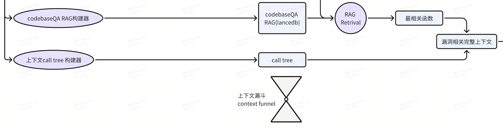

这篇文章写于2025年2月18日深夜，是关于FiniteMonkey这个引擎的思考

# 1. 起源

这个引擎的起源只有一句话"这个代码里面有一个漏洞，请你把它找出来"。当时还是gpt3.5和gpt4的时候，很有趣，这个prompt要比"这个代码里有漏洞吗？"要有效得多。

具体而言，这个有效性体现在，相比与问句而言，这个prompt似乎更能够触发大模型的推理能力或者称之为逻辑查找能力，而不仅仅是基于训练数据集的记忆。大模型也更会倾向于去找漏洞，而不是基于既有的最基本的漏洞知识去胡乱猜测。

当时有这样一个工作流：我提问=>模型回答=>我验证=>如果不是的话，用相同的prompt再问一遍，直到找到漏洞为止。

基于这句话我曾经在2年内拿到了数十万人民币的bug bounty。在最近的一次codehawks审计中，也有不错的表现。

其核心在于，如何大幅度的触发LLM的幻觉，喜欢幻觉，拥抱幻觉，我想这是很少有人能意识到的

# 2. 建设

在2024年2月，也就是文章的整整一年前，我决定开始建设这个引擎。当时ai agent的概念已经出现，不过当时并没有考虑用agent的思路来进行建设，而是只把它当做一个我人工工作流的复现工具，让整个流程更加自动化。

最初始的工作流如下：
.png)

简单来说，就是将项目直接粗暴的拆成函数粒度进行提问，每个提问10次，然后针对每一个输出进行validation，让gpt判断它是否是误报。

当然结果很差，甚至不如我人工直接来，我意识到，他需要迭代。

# 3. 迭代

## 3.1 迭代的第一步：validation与检测的粒度

首先迭代的是validation过程和检测的粒度，在整个工作流中我发现，它与我个人的工作流相差最大的就是我在提问的时候是从来不进行上下文考虑的

换句话说，当时的上下文（128k）足够我粗暴的把整个合约扔进去直接提问，但是实际上在工具中，我却用了函数，这种上下文的差别导致了一点，就是它的检出性非常的低

我曾经考虑过使用一些静态的方法进行一个合理的上下文提取，比如说针对某个函数，使用slither提取相应的上下文，但是并没有采用（后面会解释），而是使用了antlrv4

使用antlrv4，我将每一个文件进行了一个行为，称之为业务流的构建

业务流的构建的想法，曾经跟yuqiang讨论过，当时他提到，使用slither进行变量读写的提取或者函数调用的提取其实并不好，相应的，我便放弃了slither（这是其中一个原因），转而采用直接gpt提问的方式来抽取业务流，抽取业务流时候，使用的prompt为：

```
Based on the code above, analyze the business flows that start with the {function_name} function, consisting of multiple function calls. The analysis should adhere to the following requirements:
        1. only output the one sub-business flows, and must start from {function_name}.
        2. The output business flows should only involve the list of functions of the contract itself (ignoring calls to other contracts or interfaces, as well as events).
        3. After step-by-step analysis, output one result in JSON format, with the structure: {{"{function_name}":[function1,function2,function3....]}}
        4. The business flows must include all involved functions without any omissions
```
通过这种方式提取业务流然后进行提问，基于此，检测的粒度变得相对reasonable，但是仍然存在问题，现在仍未解决

接下来，validation也是同样的道理，不过validation最开始的处理方案是使用多种prompt（比如说提问是否有漏洞/提问是否有patch），经过大批量测试后发现效果并不好，后来发现实际上关键问题还是在于上下文的完整性，毕竟你不能让llm去验证一些它完全不知道的事情

## 3.2 迭代第二步：上下文

对于上下文的问题，我曾经想过粗暴的来扩展prompt输入解决，但是实际证明效果并不好，因为当项目过大的时候，你并不能直接把整个项目扔进去，而需要进行一个合理的上下文提取。

在这个时候，cursor出现了，我算是cursor的第一批用户，它的codebase QA功能让我眼前一亮，我意识到，我需要一个合理的上下文提取，而cursor的codebase QA功能恰好可以满足这一点

因此，我详细调查了一下cursor的codebase QA功能，发现它实际上是一个基于问题的RAG抽取，这好办了，RAG我熟，之前在llm4vuln中进行dev的时候用了非常多的RAG

因此自己实现一个codebaseQA的中间组件，便成了很重要的一部，现在它是这样的：



简单来说，这个组件的功能就是通过对codebase，也就是项目代码的预处理，然后根据某一个漏洞输入，提取出跟这个漏洞最相关的一个上下文

在这之中，我自己实现了一个相对复杂的call tree，以及覆盖整个项目code的RAG，最终他会产出一个上下文text，这个text我称之为context funnel（上下文漏斗）

基于这个context funnel，我便可以进行一个合理的上下文提取，然后进行漏洞的validation

## 3.3 迭代第三步：模型的选择

在整个项目的开发之中，包括3.1和3.2，我尝试过几乎所有模型，包含了gpt全家桶，claude全家桶，以及最新的o1，o3,和r1，在实际的工程实现中，我们并不能说哪个漏洞检测模型的使用是绝对的，它有很多因素要考虑，其中最重要的两个就是：

时间和成本

因为目标是一个可以直接产品化的工具，因此并不能说越强大的模型就越要用，并不能说reasoning模型（就是o1,o3,r1这些会有cot的模型）就一定要比unreasoning模型要好，因为时间和成本问题，你不可能要求一个task花费几分钟甚至接近10分钟才能得到答案，因此当前的模型选择是：

检测用claude，validation用deepseek o1

## 3.4 迭代第四步：回到检测

感谢ret2basic的启发，我意识到，最初始的prompt并非完美，一个完全依赖于大模型能力的prompt，高度受限于大模型本身的训练数据，即使你能够触发它最强大的推理和逻辑能力，但有些漏洞它是不会注意到的

因此，回到最初的prompt，我需要一个checklist，那么它从哪里来

感谢solodit，我爬取了24000个审计漏洞，感谢dacien整理的那么多checklist，我对这些漏洞和checklist进行了处理，把他们加入到了prompt里，并形成了一个简单的组件，称之为S.P.A.R.T(Smart Prompting for Automated Risk Tailoring，自动化风险prompt组合)

这样，检测的prompt似乎就变得完整了，当然还有很多需要调整的

# 4. 疑惑的解答：为什么使用antlrv4而不是slither

这个引擎有一些预设的条件,其中有一条比较关键的就是："最好的编译器是大模型"

我并非否认slither的强大，我也曾经花费非常多的时间在slither上并开发了很多规则和优化，但是slither面临一个问题就是它基于了solc，并且变得越来越重，对项目的完整性要求的越来越高，这不但不利于我进行测试，更不利于我扩展到更多语言

而antlrv4则没有这个问题，或者换句话说，一个简单的函数拆解，然后基于拆解的各种组合，不但可以满足各类的业务流抽取需求，更可以将相同的代码和架构扩展到更多的语言上，毕竟你只需要让代码进行函数粒度拆解就可以了

因此，这个引擎实际当前支持的语言非常多：不仅仅包括solidity，甚至包括solidity反编译的伪代码，rust，move，go，python，甚至可以扩展到任何语言

# 5. 设计思路

这一点才是最重要的一个部分，不同于市面上大多数检测工具，不同于我之前和yuqiang，daoyuan，liuye的工作，它并非是基于传统的确定性模式识别

传统的确定性模式识别需要对漏洞有非常细粒度的拆解和定义，然后通过大量的数据集作为打底，然后进行模式识别，不论是gptscan也好，propertygpt也好，还是llm4vuln也好，都是基于这个思路

这种思路都是基于专家经验，将漏洞解读为cot，或者解读为functionality和keyconcept，进行匹配，引导大模型进行一步步思考，但这带来了一个问题：

1. 它需要大量的专家经验和数据集，而专家经验是稀缺的，因此很难覆盖到所有漏洞
2. 它是规则驱动的，意味着它需要大量的规则，而规则的开发和维护成本非常高，就像gptscan一样，天知道yuqiang为了写那11个detector花费了多少精力:P
3. 它是规则驱动的，而这就意味着规则越严格，就越难覆盖到所有漏洞，人力会回到无限的规则回测中去
4. 在整个过程中需要经历极多次的llm提问，在这里感谢alan@secure3的文章，它让我意识到，这种复杂流程中，会产生一个致命问题：错误累积定律，简单来说就是，错误会随着流程的复杂度指数级增长，当llm action为30时，即使每一个action都有99%的准确率，最终的准确率会降低到73%，而实际上当前的llm准确率是惨不忍睹的，简单粗暴的猜测一下，每一个action大概只有60-70%的准确率，这也就意味着只需要经过10个action，准确率就会来到2%，即使是5个action，也只有16%的准确率，这种情况下，完全无法接受，导致长链检测任务必然存在准确率天花板

因此，为了解决这个问题，至少在ai audit领域内，要跳出agent action link的限制，通过以下方法论

从"寻找正确答案"转向"管理可能性空间"
A[代码输入] --> B{可能性空间构建}
B --> C[漏洞假说云]
C --> D[验证收敛]
D --> E[确定性结论]
（这里可能有更多的理论基础等待探索，后面会逐步扩展）

这种方式好处在于，我们不需要花费大力气去构建一个非常复杂的规则，而是通过构建一个可能性空间，然后通过验证收敛，最终得到一个确定性结论

另外，这种方式可以非常有效的解决错误累积定律的问题，我通过降低复杂度，从而降低错误累积定律的影响

当然，这里有一个问题需要解决：漏洞假说云是否是没有上限的？换句话说，如果10次迭代生成了10种不同漏洞，100次生成了100种不同漏洞，这岂不是意味着没完没了？

这里也就涉及到了这个项目的名称：finite monkey，finite monkey来自于无限猴子理论，在这个理论中，我们假设了某个猴子在打字机上能够打印出任何东西，也就是假设了它的可能性空间为无穷

但是在这个项目里，finite monkey在于我发现了一个llm的特点，它的可能性空间并非是无穷的，换句话说，我10次迭代，生成了10个漏洞，他们可能能够被归类为5中，而即使我再迭代下去，也很难再生成新的漏洞，它可能也是5中，换句话说，漏洞假说云是有限的

那么这样就好办了，当可能性是有限的时候，漏洞并非没完没了，而是会一直定在某几种漏洞，这也就意味着漏洞挖掘存在着收敛性，当然同时，它又具有发散性

# 6. 总结

这个项目是一个非常有趣的项目，它让我意识到，通过构建一个可能性空间，然后通过验证收敛，最终得到一个确定性结论，也许会是ai agent的一个可能方向

当然，这个方法也许并不适用所有场景，比如说coding，你不可能要求coding过程当中给你10个答案然后让你选一个最好的（看起来也不是不行），因为这里所花费的时间相对还是比较高


