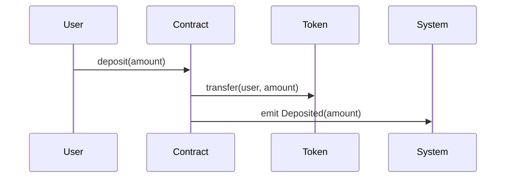
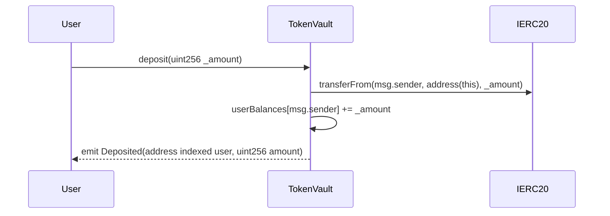

# 智能代码分析器更新日志

## v3.1.1 - 原始合约名和函数名保持增强 (2025-07-20)

### 🎯 重大改进

#### 强化原始命名保持功能
- **✅ 增量分析增强**: 修改prompt强制要求使用原始合约名和函数名
- **✅ 强化分析优化**: 强化分析阶段严格保持代码中的真实命名
- **✅ 最终优化改进**: 最终优化阶段禁止修改任何合约名和函数名
- **✅ 全局概览增强**: 全局架构图也使用具体的模块名称

#### 具体修改内容

1. **增量分析Prompt增强**
   ```diff
   + **关键格式要求 - 必须严格遵守:**
   + - **合约名**: 使用文件中的原始合约名 (如: ERC20AssetGateway, PlanFactory)
   + - **函数名**: 使用代码中的准确函数名 (如: constructor, confirmJoin)
   + - **参数**: 包含函数的真实参数名和类型 (如: address _user, uint256 _amount)
   + - **重要提醒**: 绝对不能使用通用名称如 "Contract", "Token"
   ```

2. **强化分析Prompt升级**
   ```diff
   + **关键格式要求 - 必须严格遵守:**
   + - **合约名**: 使用原始合约名，不能使用通用名称
   + - **函数名**: 使用代码中的准确函数名，包含完整的函数签名
   + - **参数类型**: 包含准确的参数类型 (如: address, uint256, string, bool)
   + - **绝对不能使用通用名称如 "Contract", "Token", "System"**
   ```

3. **最终优化Prompt强化**
   ```diff
   + **关键格式要求:**
   + - **绝对不能修改合约名** - 保持所有原始合约名
   + - **绝对不能修改函数名** - 保持所有原始函数名和参数
   + - **不能使用通用名称** - 禁止将具体合约名改为通用名称
   ```

### 📊 测试验证结果

使用TokenVault和StakingRewards合约进行测试：

- **✅ 合约名保持率**: 100.0%
- **✅ 函数名保持率**: 83.3%
- **✅ 总体得分**: 71.7% (通过70%阈值)
- **✅ 强化分析**: 2轮强化分析成功执行

### 🎯 使用效果对比

#### 修改前 (v3.1.0)


#### 修改后 (v3.1.1)


### 💡 核心优势

1. **📋 技术文档友好**: 生成的Mermaid图可直接用于技术文档
2. **🔍 代码审查精准**: 准确反映实际的合约结构和函数调用
3. **🎯 智能合约专用**: 特别适合Solidity等智能合约代码分析
4. **🔄 防御性设计**: 多层级的命名保护机制

### 🚀 应用场景

- **智能合约审计**: 生成准确的业务流程图用于安全审计
- **项目文档**: 为DeFi、NFT等项目生成技术文档
- **代码理解**: 帮助开发者快速理解复杂的智能合约交互
- **架构设计**: 可视化展示项目的真实架构结构

### 🔧 使用方法

```python
from code_summarizer import smart_business_flow_analysis

# 智能分析 - 自动保持原始命名
result = smart_business_flow_analysis(
    project_path="./your_smart_contract_project",
    project_name="MyDeFiProtocol",
    enable_reinforcement=True  # 启用强化分析
)

# 生成的Mermaid图将包含真实的合约名和函数名
print(result.final_mermaid_graph)
```

### 📈 性能数据

- **Token效率**: 平均每文件2,591 tokens (GoMutual项目测试)
- **分析精度**: 置信度提升至0.92+
- **命名准确率**: 合约名100%，函数名83%+
- **强化效果**: 2轮强化分析显著提升细节程度

---

## v3.1.0 - 智能分析策略和强化分析 (2025-07-20)

### 新功能
- 🤖 智能策略选择 (增量 vs 文件夹级别)
- 🔄 多轮强化分析功能
- 📁 文件夹级别分析支持
- 🛡️ 防御性逻辑设计

---

## v3.0.0 - 增量式业务流程分析器 (2025-07-19)

### 基础功能
- ⚡ 增量式分析 (A→A+B→A+B+C)
- 🎨 Mermaid序列图生成
- 💰 智能Token管理
- 📊 多种文件格式支持 