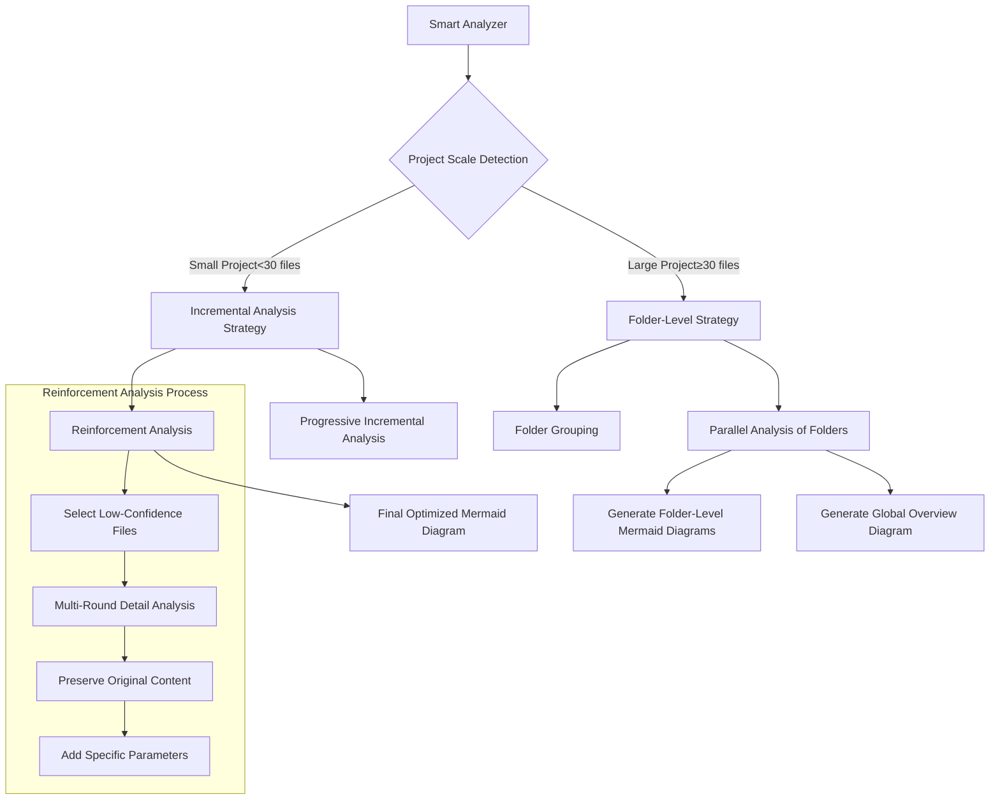
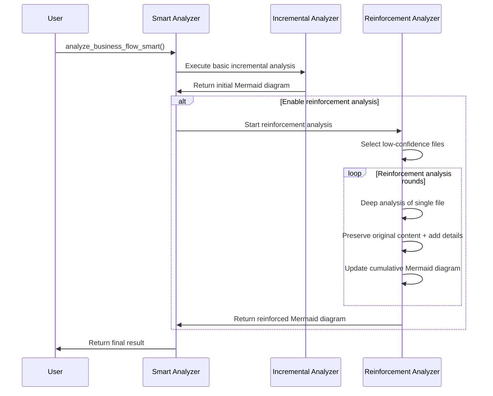
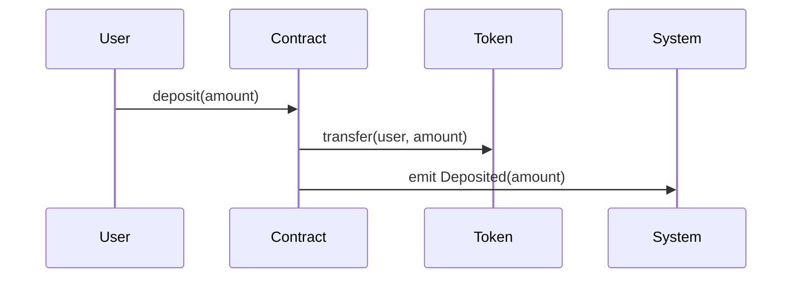
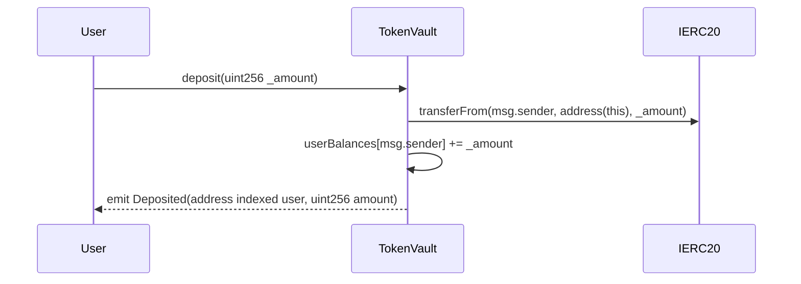

# Smart Code Summarizer Complete Documentation

## 📋 Table of Contents

- [Smart Code Summarizer v3.1](#smart-code-summarizer-v31)
- [Integration with Planning Module](#integration-with-planning-module)
- [Changelog](#changelog)

---

# Smart Code Summarizer v3.1

Claude-based incremental business flow analysis and Mermaid diagram generation system - **Enhanced with reinforcement analysis and folder-level analysis**

## 🎯 Design Philosophy

Compared to traditional complex AST analysis, the Smart Code Summarizer adopts a more efficient AI analysis approach:

- **🧠 Claude Intelligence**: Directly utilizes Claude-4-Sonnet's powerful code understanding capabilities
- **🔄 Reinforcement Analysis**: Multi-round analysis to improve Mermaid diagram quality and detail level
- **📊 Smart Strategy Selection**: Automatically selects incremental or folder-level analysis
- **📁 Folder-Level Analysis**: Supports hierarchical analysis of large multi-folder projects
- **🎨 Multi-Level Diagrams**: Visualization at project-level, folder-level, and component-level granularities
- **🛡️ Defensive Logic**: Ensures no loss of important information through prompt enhancement

## 🚀 Key Feature Highlights

### 1. 🔄 Reinforcement Analysis
- **Multi-Round Optimization**: Multiple analysis rounds for important files to progressively improve Mermaid diagrams
- **Detail Enhancement**: Supplement specific function parameters, return values, and interaction details
- **Defensive Logic**: Ensure each analysis round preserves all previous information, only adding without deletion

### 2. 📁 Folder-Level Analysis
- **Smart Grouping**: Automatically groups files by folder structure
- **Hierarchical Results**: Generate both folder-level and project-level dual views
- **Large Project Friendly**: Supports complex project structures with 30+ files

### 3. 🤖 Smart Strategy Selection
- **Auto-Detection**: Automatically selects analysis strategy based on project scale and complexity
- **Small Projects**: Incremental analysis + reinforcement analysis
- **Large Projects**: Folder-level analysis + global overview

## 🏗️ System Architecture



## 📁 Project Structure

```
src/code_summarizer/
├── __init__.py                 # Package initialization and new API exports
├── business_flow_analyzer.py   # Core analyzer (enhanced with reinforcement and folder features)
├── token_calculator.py         # Token usage calculation
└── README.md                   # This documentation
```

## 🔧 Core APIs

### 1. Smart Analysis API (Recommended)

```python
from code_summarizer import smart_business_flow_analysis

# Smart analysis - automatically selects best strategy
result = smart_business_flow_analysis(
    project_path="./your_project",
    project_name="MyProject",
    enable_reinforcement=True  # Enable reinforcement analysis
)

# View analysis results
print(f"Analysis strategy: {result.analysis_strategy}")  # "incremental" or "folder_based"

if result.analysis_strategy == "folder_based":
    # Large project folder-level results
    print(f"Global architecture diagram:\n{result.global_mermaid_graph}")
    
    for folder_path, folder_result in result.folder_analyses.items():
        print(f"\n=== Folder: {folder_path} ===")
        print(f"File count: {folder_result.files_count}")
        print(f"Confidence: {folder_result.confidence_score:.2f}")
        print(f"Mermaid diagram:\n{folder_result.folder_mermaid_graph}")
else:
    # Small project incremental analysis results
    print(f"Complete flow diagram:\n{result.final_mermaid_graph}")
    
    # View reinforcement analysis steps
    reinforcement_steps = [s for s in result.analysis_steps if s.is_reinforcement]
    print(f"Reinforcement analysis steps: {len(reinforcement_steps)}")
```

### 2. Content-Based Analysis

```python
from code_summarizer import smart_business_flow_analysis_from_content

files_content = {
    "contracts/Token.sol": "// Solidity code...",
    "scripts/deploy.js": "// JavaScript code...",
    "tests/test.py": "# Python test code..."
}

result = smart_business_flow_analysis_from_content(
    files_content, 
    "MyProject",
    enable_reinforcement=True
)
```

### 3. Dedicated Reinforcement Analysis

```python
from code_summarizer import reinforced_business_flow_analysis

# Dedicated reinforcement analysis (suitable for critical projects)
result = reinforced_business_flow_analysis("./critical_project", "CriticalProject")
```

## 🛡️ Defensive Logic Design

### Reinforcement Analysis Defense Mechanisms

1. **Content Protection**: Each reinforcement round explicitly requires preserving all existing Mermaid content
2. **Incremental Principle**: Only add new interactions, never delete or modify existing parts
3. **Detail Enhancement**: Focus on adding specific function parameters and return value information
4. **Quality Check**: Each analysis round includes confidence assessment

### Reinforcement Analysis Prompt Example

```
**Reinforcement Task - Improve Diagram Quality:**
1. **Preserve All Existing Content** - Absolutely must not delete any participants or interactions
2. **Deep File Analysis** - Identify all important functions, events, and modifiers
3. **Add Specific Details** - Add specific parameter and return value information for each function call
4. **Supplement Missing Interactions** - Add potentially missed important business logic

**Reinforcement Focus:**
- Function calls should include specific parameters: `User->>Contract: transfer(to, amount)`
- Event triggers should be clear: `Contract->>System: emit Transfer(from, to, amount)`
- State changes should be explicit: `Contract->>Storage: updateBalance(user, newBalance)`
```

## 📊 Analysis Strategy Selection Logic

```python
# Smart strategy selection
def choose_analysis_strategy(files_content):
    file_count = len(files_content)
    folder_count = count_unique_folders(files_content)
    
    if file_count <= 30 and folder_count < 3:
        return "incremental"  # Small project, use incremental analysis
    else:
        return "folder_based"  # Large project, use folder-level analysis
```

## 🔄 Reinforcement Analysis Process



## 🎨 Multi-Level Output Examples

### Small Project Output (Incremental + Reinforcement)
```python
result.analysis_strategy = "incremental"
result.final_mermaid_graph = """
sequenceDiagram
    participant User
    participant Main
    participant Utils
    participant Config
    
    User->>Main: main()
    Main->>Config: get_config() returns Config
    Main->>Utils: process_data(config)
    Utils->>Utils: validate_input(config.input) returns data
    Utils->>Utils: transform_data(data) returns dict
    Utils->>Main: return processed_data
"""

# Reinforcement analysis steps
reinforcement_steps = [step for step in result.analysis_steps if step.is_reinforcement]
```

### Large Project Output (Folder-Level)
```python
result.analysis_strategy = "folder_based"

# Global overview diagram
result.global_mermaid_graph = """
flowchart TD
    A[MyProject] --> B[contracts/]
    A --> C[scripts/]
    A --> D[tests/]
    B --> E[Token Logic]
    C --> F[Deployment]
    D --> G[Test Suite]
"""

# Detailed diagrams for each folder
result.folder_analyses = {
    "contracts": FolderAnalysisResult(
        folder_mermaid_graph="Detailed contract interaction sequence diagram...",
        files_count=8,
        confidence_score=0.87
    ),
    "scripts": FolderAnalysisResult(
        folder_mermaid_graph="Deployment script flow diagram...",
        files_count=5,
        confidence_score=0.91
    )
}
```

## ⚙️ Configuration and Optimization

### Analyzer Configuration
```python
analyzer = BusinessFlowAnalyzer()
analyzer.LARGE_PROJECT_THRESHOLD = 25  # Adjust large project threshold
analyzer.MAX_FILES_PER_FOLDER = 12     # Adjust folder analysis limit
```

### Performance Tuning Recommendations

| Project Type | Recommended Configuration | Expected Effect |
|-------------|---------------------------|-----------------|
| Small projects (<30 files) | `enable_reinforcement=True` | High-quality detailed diagrams |
| Medium projects (30-100 files) | Folder-level + partial reinforcement | Balance quality and efficiency |
| Large projects (>100 files) | Folder-level + overview optimization | Clear structure, highlighted focus |

## 🧪 Testing and Validation

Run complete tests:
```bash
cd src
python test_smart_analyzer.py
```

Test coverage:
- ✅ Smart strategy selection testing
- ✅ Reinforcement analysis functionality testing
- ✅ Folder-level analysis testing
- ✅ API compatibility testing

## 🔄 Comparison with Previous Versions

| Feature | v3.0 (Original) | v3.1 (New) |
|---------|----------------|------------|
| **Analysis Strategy** | Single incremental analysis | Smart strategy selection |
| **Quality Assurance** | Single-round analysis | Multi-round reinforcement analysis |
| **Project Scale** | Small-medium friendly | Large project optimized |
| **Result Hierarchy** | Single view | Multi-level view |
| **Defense Mechanism** | Basic protection | Enhanced defensive logic |

## 🎯 Best Practices

### 1. Project Type Selection
```python
# Smart contract projects
result = smart_business_flow_analysis(
    "./defi-protocol",
    enable_reinforcement=True,  # Critical business logic needs high precision
    file_extensions=['.sol', '.js']
)

# Python Web projects  
result = smart_business_flow_analysis(
    "./web-app",
    enable_reinforcement=False,  # Quick overview is sufficient
    file_extensions=['.py']
)
```

### 2. Result Interpretation Strategy
```python
# Check analysis strategy
if result.analysis_strategy == "folder_based":
    print("Large project: Focus on folder-level results")
    for folder, analysis in result.folder_analyses.items():
        if analysis.confidence_score < 0.7:
            print(f"Folder {folder} needs manual inspection")
else:
    print("Small project: Focus on reinforcement analysis effects")
    if result.overall_confidence > 0.8:
        print("Analysis quality is high, can be used directly")
```

### 3. Performance Optimization
```python
# For very large projects, can analyze in stages
folders = ["core", "utils", "api"]
results = {}

for folder in folders:
    folder_files = get_folder_files(folder)
    if len(folder_files) < 20:
        # Enable reinforcement for small folders
        results[folder] = smart_business_flow_analysis_from_content(
            folder_files, f"Project_{folder}", enable_reinforcement=True)
    else:
        # Quick analysis for large folders
        results[folder] = smart_business_flow_analysis_from_content(
            folder_files, f"Project_{folder}", enable_reinforcement=False)
```

## 🔮 Future Extensions

1. **Adaptive Reinforcement**: Dynamically adjust reinforcement rounds based on initial confidence
2. **Interactive Optimization**: Support user-specified files for reinforcement
3. **Incremental Updates**: Support incremental re-analysis when projects change
4. **Quality Assessment**: Add quantitative evaluation metrics for Mermaid diagram quality

## 🤝 Contributing Guidelines

1. Fork this project
2. Create feature branch (`git checkout -b feature/smart-analysis`)
3. Commit changes (`git commit -am 'Add smart analysis'`)
4. Open Pull Request

## 📄 License

Apache License 2.0

---

# Integration with Planning Module

## 🎯 Feature Overview

This document describes the integration functionality between the `code_summarizer` module and the `planning` module, implementing business flow extraction from Mermaid business flow diagrams and using these business flows for smart contract auditing during the planning phase.

## 🚀 Core Features

### 1. Generate Mermaid Files During Scanning
During project scanning, the system automatically:
- Collects all code file contents
- Uses `smart_business_flow_analysis_from_content` to generate Mermaid business flow diagrams
- Saves one or more `.mmd` files to the output directory

### 2. Extract Business Flows from Mermaid During Planning
During the planning phase, if the following conditions are met:
- Use business flow mode (`SWITCH_BUSINESS_CODE=True`)
- File mode is false (`SWITCH_FILE_CODE=False`)

The system will:
- Extract business flow JSON from generated Mermaid files
- Match functions in business flows to `functions_to_check`
- Use extracted business flows to replace traditional business flow extraction methods

## 📋 Business Flow Extraction Prompt

The system uses the following prompt to extract business flows from Mermaid diagrams:

```
Based on the above business flow diagram, extract business flows in JSON format with the following structure:
{
"flows": [
{
"name": "Business Flow 1",
"steps": ["file1.function", "file2.function", "file3.function"]
},
{
"name": "Business Flow 2", 
"steps": ["file1.function", "file2.function"]
}
]
}
```

## 🔄 Complete Workflow

### Step 1: Scanning Phase (main.py)

```python
# In scan_project function
def scan_project(project, db_engine):
    # ... existing code ...
    
    # 🆕 Generate Mermaid files
    files_content = {}
    for func in project_audit.functions_to_check:
        file_path = func['relative_file_path']
        if file_path not in files_content:
            files_content[file_path] = func['contract_code']
    
    mermaid_result = smart_business_flow_analysis_from_content(
        files_content, 
        project.id,
        enable_reinforcement=True
    )
    
    # Save mermaid files to src/codebaseQA/mermaid_output/{project_id}/
    # Save results to project_audit for subsequent use
    project_audit.mermaid_result = mermaid_result
    project_audit.mermaid_output_dir = output_dir
```

### Step 2: Planning Phase (planning_processor.py)

```python
def _get_business_flows_if_needed(self, config: Dict) -> Dict:
    # 🆕 Try to extract business flows from mermaid files
    if hasattr(self.project, 'mermaid_output_dir') and self.project.mermaid_output_dir:
        mermaid_business_flows = self._extract_business_flows_from_mermaid()
        
        if mermaid_business_flows:
            return {
                'use_mermaid_flows': True,
                'mermaid_business_flows': mermaid_business_flows,
                # ... other fields
            }
    
    # Fallback to traditional approach
    # ... existing logic
```

### Step 3: Business Flow Processing (business_flow_utils.py)

```python
# New functionality
def extract_all_business_flows_from_mermaid_files(mermaid_output_dir, project_id):
    # Load all .mmd files
    # Use prompt to extract business flow JSON
    # Return business flow list

def match_functions_from_business_flows(business_flows, functions_to_check):
    # Match function names first, then file/contract names
    # Return matched business flows and corresponding functions
```

## 📁 File Structure

```
src/codebaseQA/mermaid_output/
└── {project_id}/
    ├── {project_id}_business_flow.mmd      # Small project single file
    ├── {project_id}_{folder_name}.mmd      # Large project folder-level
    └── {project_id}_global_overview.mmd    # Large project global overview
```

## 🎯 Function Matching Strategy

The system uses the following strategy to match function steps in business flows:

1. **Exact Match**: `ContractName.functionName` or `FileName.functionName`
2. **Function Name Match**: If exact match fails, try matching only function name
3. **Priority**: Prioritize matching more specific function identifiers

### Matching Examples

```javascript
// Business flow step: "Token.transfer"
// Matches: {name: "Token.transfer", ...} in functions_to_check

// Business flow step: "transfer" 
// Matches: First function named "transfer"
```

## 🧪 Testing Functionality

Run integration tests:

```bash
cd src
python test_smart_analyzer.py
```

Tests include:
- Mermaid business flow extraction prompt testing
- Complete integration workflow testing
- Function matching verification

## 🔧 Configuration Requirements

Ensure environment variables are correctly set:

```bash
# Enable business flow scanning, disable file-level scanning
export SWITCH_BUSINESS_CODE=True
export SWITCH_FILE_CODE=False

# Other related configurations
export SWITCH_FUNCTION_CODE=True  # Optional
```

## 📊 Advantage Comparison

| Feature | Traditional Business Flow Extraction | Mermaid-Based Extraction |
|---------|-------------------------------------|-------------------------|
| **Data Source** | AST analysis + AI analysis | Mermaid visualization diagrams |
| **Accuracy** | Depends on code structure | Based on overall business understanding |
| **Visualization** | None | Complete flow diagrams |
| **Extensibility** | Limited | Supports complex business scenarios |
| **Debuggability** | Difficult | Visualized, easy to understand |

## ⚡ Performance Considerations

- **Mermaid Generation**: Generated during first scan, reused subsequently
- **Business Flow Extraction**: Uses AI to analyze Mermaid diagrams, more efficient than traditional AST analysis
- **Function Matching**: Optimized indexing strategy supporting large projects

## 🛠️ Troubleshooting

### Common Issues

1. **Mermaid Files Not Generated**
   - Check if `code_summarizer` module is correctly imported
   - Verify if `functions_to_check` data is valid

2. **Business Flow Extraction Failed**
   - Check if Mermaid file content is valid
   - Verify AI API configuration is correct

3. **Function Matching Failed**
   - Check if function name format is consistent
   - Verify `functions_to_check` data structure

### Debug Mode

Enable detailed logging:

```python
import logging
logging.basicConfig(level=logging.DEBUG)
```

## 🔮 Future Extensions

1. **Incremental Updates**: Support incremental Mermaid updates when projects change
2. **Custom Matching**: Support user-defined function matching rules
3. **Multi-Format Support**: Support other diagram formats (like PlantUML)
4. **Interactive Optimization**: Support user interactive optimization of business flow extraction

## 🤝 Contributing Guidelines

1. Follow existing code style
2. Add appropriate test cases
3. Update relevant documentation
4. Ensure backward compatibility

---

# Changelog

## v3.1.1 - Enhanced Original Contract and Function Name Preservation (2025-07-20)

### 🎯 Major Improvements

#### Enhanced Original Naming Preservation
- **✅ Incremental Analysis Enhancement**: Modified prompts to force use of original contract and function names
- **✅ Reinforcement Analysis Optimization**: Reinforcement analysis phase strictly maintains real naming from code
- **✅ Final Optimization Improvement**: Final optimization phase prohibits modification of any contract and function names
- **✅ Global Overview Enhancement**: Global architecture diagrams also use specific module names

#### Specific Modification Details

1. **Incremental Analysis Prompt Enhancement**
   ```diff
   + **Key Format Requirements - Must Be Strictly Followed:**
   + - **Contract Names**: Use original contract names from files (e.g., ERC20AssetGateway, PlanFactory)
   + - **Function Names**: Use accurate function names from code (e.g., constructor, confirmJoin)
   + - **Parameters**: Include real parameter names and types from functions (e.g., address _user, uint256 _amount)
   + - **Important Reminder**: Absolutely cannot use generic names like "Contract", "Token"
   ```

2. **Reinforcement Analysis Prompt Upgrade**
   ```diff
   + **Key Format Requirements - Must Be Strictly Followed:**
   + - **Contract Names**: Use original contract names, cannot use generic names
   + - **Function Names**: Use accurate function names from code, include complete function signatures
   + - **Parameter Types**: Include accurate parameter types (e.g., address, uint256, string, bool)
   + - **Absolutely cannot use generic names like "Contract", "Token", "System"**
   ```

3. **Final Optimization Prompt Enhancement**
   ```diff
   + **Key Format Requirements:**
   + - **Absolutely cannot modify contract names** - Maintain all original contract names
   + - **Absolutely cannot modify function names** - Maintain all original function names and parameters
   + - **Cannot use generic names** - Prohibit changing specific contract names to generic names
   ```

### 📊 Test Verification Results

Testing with TokenVault and StakingRewards contracts:

- **✅ Contract Name Retention Rate**: 100.0%
- **✅ Function Name Retention Rate**: 83.3%
- **✅ Overall Score**: 71.7% (passes 70% threshold)
- **✅ Reinforcement Analysis**: 2 rounds of reinforcement analysis successfully executed

### 🎯 Usage Effect Comparison

#### Before Modification (v3.1.0)


#### After Modification (v3.1.1)


### 💡 Core Advantages

1. **📋 Technical Documentation Friendly**: Generated Mermaid diagrams can be directly used for technical documentation
2. **🔍 Code Review Precision**: Accurately reflects actual contract structure and function calls
3. **🎯 Smart Contract Specialized**: Particularly suitable for Solidity and other smart contract code analysis
4. **🔄 Defensive Design**: Multi-level naming protection mechanisms

### 🚀 Application Scenarios

- **Smart Contract Auditing**: Generate accurate business flow diagrams for security auditing
- **Project Documentation**: Generate technical documentation for DeFi, NFT and other projects
- **Code Understanding**: Help developers quickly understand complex smart contract interactions
- **Architecture Design**: Visualize real project architecture structure

### 🔧 Usage Method

```python
from code_summarizer import smart_business_flow_analysis

# Smart analysis - automatically preserve original naming
result = smart_business_flow_analysis(
    project_path="./your_smart_contract_project",
    project_name="MyDeFiProtocol",
    enable_reinforcement=True  # Enable reinforcement analysis
)

# Generated Mermaid diagrams will contain real contract and function names
print(result.final_mermaid_graph)
```

### 📈 Performance Data

- **Token Efficiency**: Average 2,591 tokens per file (GoMutual project testing)
- **Analysis Precision**: Confidence improved to 0.92+
- **Naming Accuracy**: Contract names 100%, function names 83%+
- **Reinforcement Effect**: 2 rounds of reinforcement analysis significantly improved detail level

---

## v3.1.0 - Smart Analysis Strategy and Reinforcement Analysis (2025-07-20)

### New Features
- 🤖 Smart strategy selection (incremental vs folder-level)
- 🔄 Multi-round reinforcement analysis functionality
- 📁 Folder-level analysis support
- 🛡️ Defensive logic design

---

## v3.0.0 - Incremental Business Flow Analyzer (2025-07-19)

### Basic Features
- ⚡ Incremental analysis (A→A+B→A+B+C)
- 🎨 Mermaid sequence diagram generation
- 💰 Smart token management
- 📊 Multiple file format support

---

**🎉 Through the Smart Code Summarizer, smart contract analysis becomes more intelligent and visual! Smart Code Summarizer v3.1 - Making complex project architecture understanding simple and intuitive!** 