# 智能代码总结器 (Smart Code Summarizer) v3.1

基于Claude的增量式业务流程分析和Mermaid图生成系统 - **新增强化分析和文件夹级别分析**

## 🎯 设计理念

相比传统的复杂AST分析，智能代码总结器采用更高效的AI分析方案：

- **🧠 Claude智能理解**：直接使用Claude-4-Sonnet的强大代码理解能力
- **🔄 强化分析**：多轮分析提升Mermaid图质量和细节程度  
- **📊 智能策略选择**：自动选择增量或文件夹级别分析
- **📁 文件夹级别分析**：支持大型多文件夹项目的层次化分析
- **🎨 多层次图表**：项目级、文件夹级、组件级多种粒度的可视化
- **🛡️ 防御性逻辑**：通过prompt强化确保不丢失重要信息

## 🚀 新功能亮点

### 1. 🔄 强化分析 (Reinforcement Analysis)
- **多轮优化**：对重要文件进行多轮分析，逐步完善Mermaid图
- **细节增强**：补充具体的函数参数、返回值和交互细节
- **防御性逻辑**：确保每轮分析都保留之前的所有信息，只增加不删除

### 2. 📁 文件夹级别分析 (Folder-Based Analysis)  
- **智能分组**：自动按文件夹结构分组文件
- **层次化结果**：生成文件夹级别和项目级别的双重视图
- **大项目友好**：支持30+文件的复杂项目结构

### 3. 🤖 智能策略选择 (Smart Strategy Selection)
- **自动检测**：根据项目规模和复杂度自动选择分析策略
- **小项目**：增量分析 + 强化分析
- **大项目**：文件夹级别分析 + 全局概览

## 🏗️ 系统架构

```mermaid
flowchart TD
    A[Smart Analyzer] --> B{项目规模检测}
    B -->|小型项目<30文件| C[增量分析策略]
    B -->|大型项目≥30文件| D[文件夹级别策略]
    
    C --> E[逐步增量分析]
    C --> F[强化分析]
    F --> G[最终优化的Mermaid图]
    
    D --> H[文件夹分组]
    D --> I[并行分析各文件夹]
    I --> J[生成文件夹级Mermaid图]
    I --> K[生成全局概览图]
    
    subgraph "强化分析流程"
        F --> F1[选择低置信度文件]
        F1 --> F2[多轮细节分析]
        F2 --> F3[保留原有内容]
        F3 --> F4[增加具体参数]
    end
```



## 📁 项目结构

```
src/code_summarizer/
├── __init__.py                 # 包初始化和新API导出
├── business_flow_analyzer.py   # 核心分析器（新增强化和文件夹功能）
├── token_calculator.py         # Token使用量计算
└── README.md                   # 本文档
```

## 🔧 核心API

### 1. 智能分析API（推荐）

```python
from code_summarizer import smart_business_flow_analysis

# 智能分析 - 自动选择最佳策略
result = smart_business_flow_analysis(
    project_path="./your_project",
    project_name="MyProject",
    enable_reinforcement=True  # 启用强化分析
)

# 查看分析结果
print(f"分析策略: {result.analysis_strategy}")  # "incremental" 或 "folder_based"

if result.analysis_strategy == "folder_based":
    # 大项目的文件夹级别结果
    print(f"全局架构图:\n{result.global_mermaid_graph}")
    
    for folder_path, folder_result in result.folder_analyses.items():
        print(f"\n=== 文件夹: {folder_path} ===")
        print(f"文件数: {folder_result.files_count}")
        print(f"置信度: {folder_result.confidence_score:.2f}")
        print(f"Mermaid图:\n{folder_result.folder_mermaid_graph}")
else:
    # 小项目的增量分析结果
    print(f"完整流程图:\n{result.final_mermaid_graph}")
    
    # 查看强化分析步骤
    reinforcement_steps = [s for s in result.analysis_steps if s.is_reinforcement]
    print(f"强化分析步骤数: {len(reinforcement_steps)}")
```

### 2. 从内容分析

```python
from code_summarizer import smart_business_flow_analysis_from_content

files_content = {
    "contracts/Token.sol": "// Solidity代码...",
    "scripts/deploy.js": "// JavaScript代码...",
    "tests/test.py": "# Python测试代码..."
}

result = smart_business_flow_analysis_from_content(
    files_content, 
    "MyProject",
    enable_reinforcement=True
)
```

### 3. 专门的强化分析

```python
from code_summarizer import reinforced_business_flow_analysis

# 专门启用强化分析（适合关键项目）
result = reinforced_business_flow_analysis("./critical_project", "CriticalProject")
```

## 🛡️ 防御性逻辑设计

### 强化分析的防御机制

1. **内容保护**：每轮强化都明确要求保留所有现有Mermaid内容
2. **增量原则**：只能新增交互，绝不删除或修改原有部分
3. **细节增强**：专注添加具体的函数参数和返回值信息
4. **质量检查**：每轮分析都包含置信度评估

### 强化分析Prompt示例

```
**强化任务 - 提升图表质量:**
1. **保留所有现有内容** - 绝对不能删除任何participant或交互
2. **深度分析文件** - 识别其中所有重要的函数、事件、修饰符
3. **增加具体细节** - 为每个函数调用添加具体参数和返回值信息
4. **补充遗漏的交互** - 添加可能被遗漏的重要业务逻辑

**强化重点:**
- 函数调用要包含具体参数: `User->>Contract: transfer(to, amount)`
- 事件触发要明确: `Contract->>System: emit Transfer(from, to, amount)`
- 状态变更要清楚: `Contract->>Storage: updateBalance(user, newBalance)`
```

## 📊 分析策略选择逻辑

```python
# 智能策略选择
def choose_analysis_strategy(files_content):
    file_count = len(files_content)
    folder_count = count_unique_folders(files_content)
    
    if file_count <= 30 and folder_count < 3:
        return "incremental"  # 小型项目，使用增量分析
    else:
        return "folder_based"  # 大型项目，使用文件夹级别分析
```

## 🔄 强化分析流程

```mermaid
sequenceDiagram
    participant UA as User
    participant SA as Smart Analyzer
    participant IA as Incremental Analyzer  
    participant RA as Reinforcement Analyzer
    
    UA->>SA: analyze_business_flow_smart()
    SA->>IA: 执行基础增量分析
    IA->>SA: 返回初始Mermaid图
    
    alt 启用强化分析
        SA->>RA: 启动强化分析
        RA->>RA: 选择低置信度文件
        loop 强化分析轮次
            RA->>RA: 深度分析单个文件
            RA->>RA: 保留原有内容 + 增加细节
            RA->>RA: 更新累积Mermaid图
        end
        RA->>SA: 返回强化后的Mermaid图
    end
    
    SA->>UA: 返回最终结果
```



## 🎨 多层次输出示例

### 小项目输出（增量 + 强化）
```python
result.analysis_strategy = "incremental"
result.final_mermaid_graph = """
sequenceDiagram
    participant User
    participant Main
    participant Utils
    participant Config
    
    User->>Main: main()
    Main->>Config: get_config() returns Config
    Main->>Utils: process_data(config)
    Utils->>Utils: validate_input(config.input) returns data
    Utils->>Utils: transform_data(data) returns dict
    Utils->>Main: return processed_data
"""

# 强化分析步骤
reinforcement_steps = [step for step in result.analysis_steps if step.is_reinforcement]
```

### 大项目输出（文件夹级别）
```python
result.analysis_strategy = "folder_based"

# 全局概览图
result.global_mermaid_graph = """
flowchart TD
    A[MyProject] --> B[contracts/]
    A --> C[scripts/]
    A --> D[tests/]
    B --> E[Token Logic]
    C --> F[Deployment]
    D --> G[Test Suite]
"""

# 各文件夹的详细图
result.folder_analyses = {
    "contracts": FolderAnalysisResult(
        folder_mermaid_graph="详细的合约交互序列图...",
        files_count=8,
        confidence_score=0.87
    ),
    "scripts": FolderAnalysisResult(
        folder_mermaid_graph="部署脚本流程图...",
        files_count=5,
        confidence_score=0.91
    )
}
```

## ⚙️ 配置与优化

### 分析器配置
```python
analyzer = BusinessFlowAnalyzer()
analyzer.LARGE_PROJECT_THRESHOLD = 25  # 调整大项目阈值
analyzer.MAX_FILES_PER_FOLDER = 12     # 调整文件夹分析限制
```

### 性能调优建议

| 项目类型 | 推荐配置 | 预期效果 |
|---------|---------|---------|
| 小型项目 (<30文件) | `enable_reinforcement=True` | 高质量详细图表 |
| 中型项目 (30-100文件) | 文件夹级别 + 部分强化 | 平衡质量和效率 |
| 大型项目 (>100文件) | 文件夹级别 + 概览优化 | 结构清晰，重点突出 |

## 🧪 测试验证

运行完整测试：
```bash
cd src
python test_smart_analyzer.py
```

测试覆盖：
- ✅ 智能策略选择测试
- ✅ 强化分析功能测试  
- ✅ 文件夹级别分析测试
- ✅ API兼容性测试

## 🔄 与原版本对比

| 特性 | v3.0 (原版) | v3.1 (新版) |
|------|------------|------------|
| **分析策略** | 单一增量分析 | 智能策略选择 |
| **质量保证** | 单轮分析 | 多轮强化分析 |
| **项目规模** | 中小型友好 | 大型项目优化 |
| **结果层次** | 单一视图 | 多层次视图 |
| **防御机制** | 基础防护 | 强化防御逻辑 |

## 🎯 最佳实践

### 1. 项目类型选择
```python
# 智能合约项目
result = smart_business_flow_analysis(
    "./defi-protocol",
    enable_reinforcement=True,  # 关键业务逻辑需要高精度
    file_extensions=['.sol', '.js']
)

# Python Web项目  
result = smart_business_flow_analysis(
    "./web-app",
    enable_reinforcement=False,  # 快速概览即可
    file_extensions=['.py']
)
```

### 2. 结果解读策略
```python
# 检查分析策略
if result.analysis_strategy == "folder_based":
    print("大项目：关注文件夹级别的结果")
    for folder, analysis in result.folder_analyses.items():
        if analysis.confidence_score < 0.7:
            print(f"文件夹 {folder} 需要人工检查")
else:
    print("小项目：关注强化分析的效果")
    if result.overall_confidence > 0.8:
        print("分析质量较高，可以直接使用")
```

### 3. 性能优化
```python
# 对于超大项目，可以分阶段分析
folders = ["core", "utils", "api"]
results = {}

for folder in folders:
    folder_files = get_folder_files(folder)
    if len(folder_files) < 20:
        # 小文件夹启用强化
        results[folder] = smart_business_flow_analysis_from_content(
            folder_files, f"Project_{folder}", enable_reinforcement=True)
    else:
        # 大文件夹快速分析
        results[folder] = smart_business_flow_analysis_from_content(
            folder_files, f"Project_{folder}", enable_reinforcement=False)
```

## 🔮 未来扩展

1. **自适应强化**：根据初始置信度动态调整强化轮次
2. **交互式优化**：支持用户指定需要强化的特定文件
3. **增量更新**：支持项目变更时的增量重新分析
4. **质量评估**：添加Mermaid图质量的量化评估指标

## 🤝 贡献指南

1. Fork本项目
2. 创建特性分支 (`git checkout -b feature/smart-analysis`)
3. 提交代码变更 (`git commit -am 'Add smart analysis'`)
4. 发起Pull Request

## 📄 许可证

Apache License 2.0

---

**🎉 智能代码总结器v3.1 - 让复杂项目的架构理解变得简单直观！** 