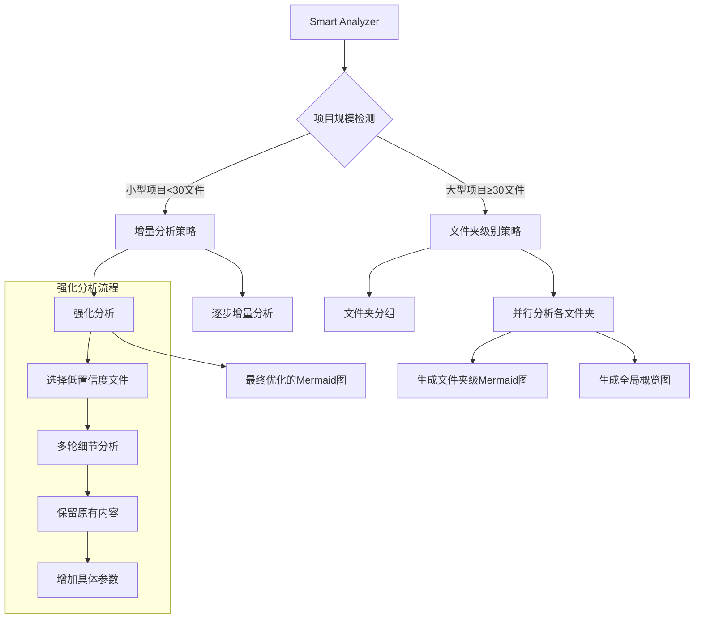
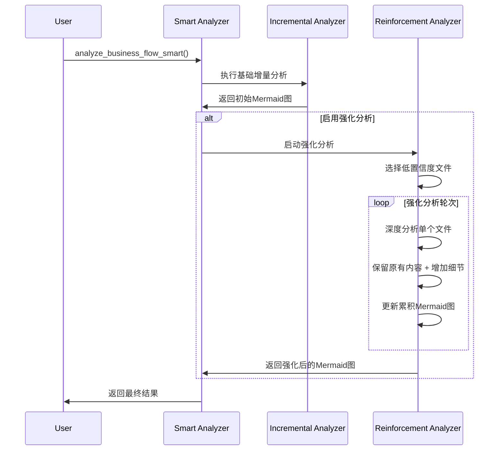
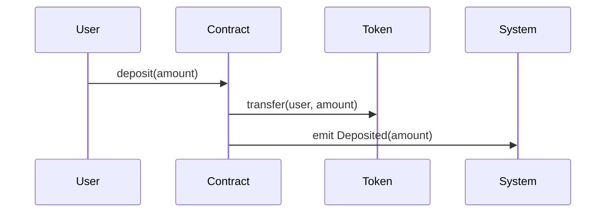
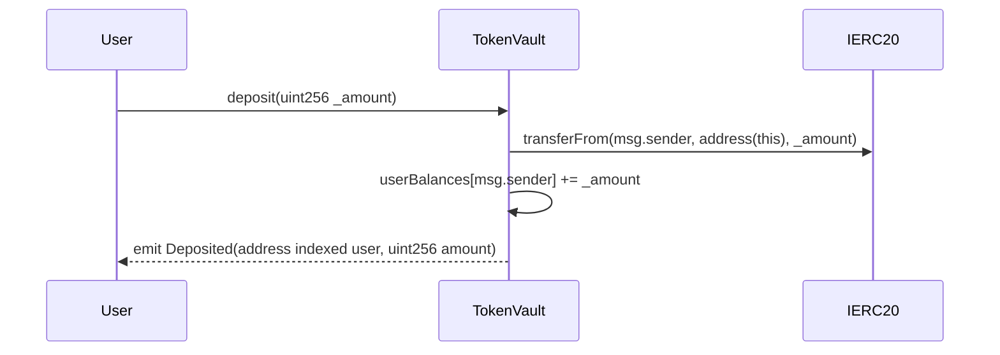

# 智能代码总结器完整文档

## 📋 目录

- [智能代码总结器 v3.1](#智能代码总结器-v31)
- [与Planning模块集成功能](#与planning模块集成功能)
- [更新日志](#更新日志)

---

# 智能代码总结器 v3.1

基于Claude的增量式业务流程分析和Mermaid图生成系统 - **新增强化分析和文件夹级别分析**

## 🎯 设计理念

相比传统的复杂AST分析，智能代码总结器采用更高效的AI分析方案：

- **🧠 Claude智能理解**：直接使用Claude-4-Sonnet的强大代码理解能力
- **🔄 强化分析**：多轮分析提升Mermaid图质量和细节程度  
- **📊 智能策略选择**：自动选择增量或文件夹级别分析
- **📁 文件夹级别分析**：支持大型多文件夹项目的层次化分析
- **🎨 多层次图表**：项目级、文件夹级、组件级多种粒度的可视化
- **🛡️ 防御性逻辑**：通过prompt强化确保不丢失重要信息

## 🚀 新功能亮点

### 1. 🔄 强化分析 (Reinforcement Analysis)
- **多轮优化**：对重要文件进行多轮分析，逐步完善Mermaid图
- **细节增强**：补充具体的函数参数、返回值和交互细节
- **防御性逻辑**：确保每轮分析都保留之前的所有信息，只增加不删除

### 2. 📁 文件夹级别分析 (Folder-Based Analysis)  
- **智能分组**：自动按文件夹结构分组文件
- **层次化结果**：生成文件夹级别和项目级别的双重视图
- **大项目友好**：支持30+文件的复杂项目结构

### 3. 🤖 智能策略选择 (Smart Strategy Selection)
- **自动检测**：根据项目规模和复杂度自动选择分析策略
- **小项目**：增量分析 + 强化分析
- **大项目**：文件夹级别分析 + 全局概览

## 🏗️ 系统架构



## 📁 项目结构

```
src/code_summarizer/
├── __init__.py                 # 包初始化和新API导出
├── business_flow_analyzer.py   # 核心分析器（新增强化和文件夹功能）
├── token_calculator.py         # Token使用量计算
└── README.md                   # 本文档
```

## 🔧 核心API

### 1. 智能分析API（推荐）

```python
from code_summarizer import smart_business_flow_analysis

# 智能分析 - 自动选择最佳策略
result = smart_business_flow_analysis(
    project_path="./your_project",
    project_name="MyProject",
    enable_reinforcement=True  # 启用强化分析
)

# 查看分析结果
print(f"分析策略: {result.analysis_strategy}")  # "incremental" 或 "folder_based"

if result.analysis_strategy == "folder_based":
    # 大项目的文件夹级别结果
    print(f"全局架构图:\n{result.global_mermaid_graph}")
    
    for folder_path, folder_result in result.folder_analyses.items():
        print(f"\n=== 文件夹: {folder_path} ===")
        print(f"文件数: {folder_result.files_count}")
        print(f"置信度: {folder_result.confidence_score:.2f}")
        print(f"Mermaid图:\n{folder_result.folder_mermaid_graph}")
else:
    # 小项目的增量分析结果
    print(f"完整流程图:\n{result.final_mermaid_graph}")
    
    # 查看强化分析步骤
    reinforcement_steps = [s for s in result.analysis_steps if s.is_reinforcement]
    print(f"强化分析步骤数: {len(reinforcement_steps)}")
```

### 2. 从内容分析

```python
from code_summarizer import smart_business_flow_analysis_from_content

files_content = {
    "contracts/Token.sol": "// Solidity代码...",
    "scripts/deploy.js": "// JavaScript代码...",
    "tests/test.py": "# Python测试代码..."
}

result = smart_business_flow_analysis_from_content(
    files_content, 
    "MyProject",
    enable_reinforcement=True
)
```

### 3. 专门的强化分析

```python
from code_summarizer import reinforced_business_flow_analysis

# 专门启用强化分析（适合关键项目）
result = reinforced_business_flow_analysis("./critical_project", "CriticalProject")
```

## 🛡️ 防御性逻辑设计

### 强化分析的防御机制

1. **内容保护**：每轮强化都明确要求保留所有现有Mermaid内容
2. **增量原则**：只能新增交互，绝不删除或修改原有部分
3. **细节增强**：专注添加具体的函数参数和返回值信息
4. **质量检查**：每轮分析都包含置信度评估

### 强化分析Prompt示例

```
**强化任务 - 提升图表质量:**
1. **保留所有现有内容** - 绝对不能删除任何participant或交互
2. **深度分析文件** - 识别其中所有重要的函数、事件、修饰符
3. **增加具体细节** - 为每个函数调用添加具体参数和返回值信息
4. **补充遗漏的交互** - 添加可能被遗漏的重要业务逻辑

**强化重点:**
- 函数调用要包含具体参数: `User->>Contract: transfer(to, amount)`
- 事件触发要明确: `Contract->>System: emit Transfer(from, to, amount)`
- 状态变更要清楚: `Contract->>Storage: updateBalance(user, newBalance)`
```

## 📊 分析策略选择逻辑

```python
# 智能策略选择
def choose_analysis_strategy(files_content):
    file_count = len(files_content)
    folder_count = count_unique_folders(files_content)
    
    if file_count <= 30 and folder_count < 3:
        return "incremental"  # 小型项目，使用增量分析
    else:
        return "folder_based"  # 大型项目，使用文件夹级别分析
```

## 🔄 强化分析流程



## 🎨 多层次输出示例

### 小项目输出（增量 + 强化）
```python
result.analysis_strategy = "incremental"
result.final_mermaid_graph = """
sequenceDiagram
    participant User
    participant Main
    participant Utils
    participant Config
    
    User->>Main: main()
    Main->>Config: get_config() returns Config
    Main->>Utils: process_data(config)
    Utils->>Utils: validate_input(config.input) returns data
    Utils->>Utils: transform_data(data) returns dict
    Utils->>Main: return processed_data
"""

# 强化分析步骤
reinforcement_steps = [step for step in result.analysis_steps if step.is_reinforcement]
```

### 大项目输出（文件夹级别）
```python
result.analysis_strategy = "folder_based"

# 全局概览图
result.global_mermaid_graph = """
flowchart TD
    A[MyProject] --> B[contracts/]
    A --> C[scripts/]
    A --> D[tests/]
    B --> E[Token Logic]
    C --> F[Deployment]
    D --> G[Test Suite]
"""

# 各文件夹的详细图
result.folder_analyses = {
    "contracts": FolderAnalysisResult(
        folder_mermaid_graph="详细的合约交互序列图...",
        files_count=8,
        confidence_score=0.87
    ),
    "scripts": FolderAnalysisResult(
        folder_mermaid_graph="部署脚本流程图...",
        files_count=5,
        confidence_score=0.91
    )
}
```

## ⚙️ 配置与优化

### 分析器配置
```python
analyzer = BusinessFlowAnalyzer()
analyzer.LARGE_PROJECT_THRESHOLD = 25  # 调整大项目阈值
analyzer.MAX_FILES_PER_FOLDER = 12     # 调整文件夹分析限制
```

### 性能调优建议

| 项目类型 | 推荐配置 | 预期效果 |
|---------|---------|---------|
| 小型项目 (<30文件) | `enable_reinforcement=True` | 高质量详细图表 |
| 中型项目 (30-100文件) | 文件夹级别 + 部分强化 | 平衡质量和效率 |
| 大型项目 (>100文件) | 文件夹级别 + 概览优化 | 结构清晰，重点突出 |

## 🧪 测试验证

运行完整测试：
```bash
cd src
python test_smart_analyzer.py
```

测试覆盖：
- ✅ 智能策略选择测试
- ✅ 强化分析功能测试  
- ✅ 文件夹级别分析测试
- ✅ API兼容性测试

## 🔄 与原版本对比

| 特性 | v3.0 (原版) | v3.1 (新版) |
|------|------------|------------|
| **分析策略** | 单一增量分析 | 智能策略选择 |
| **质量保证** | 单轮分析 | 多轮强化分析 |
| **项目规模** | 中小型友好 | 大型项目优化 |
| **结果层次** | 单一视图 | 多层次视图 |
| **防御机制** | 基础防护 | 强化防御逻辑 |

## 🎯 最佳实践

### 1. 项目类型选择
```python
# 智能合约项目
result = smart_business_flow_analysis(
    "./defi-protocol",
    enable_reinforcement=True,  # 关键业务逻辑需要高精度
    file_extensions=['.sol', '.js']
)

# Python Web项目  
result = smart_business_flow_analysis(
    "./web-app",
    enable_reinforcement=False,  # 快速概览即可
    file_extensions=['.py']
)
```

### 2. 结果解读策略
```python
# 检查分析策略
if result.analysis_strategy == "folder_based":
    print("大项目：关注文件夹级别的结果")
    for folder, analysis in result.folder_analyses.items():
        if analysis.confidence_score < 0.7:
            print(f"文件夹 {folder} 需要人工检查")
else:
    print("小项目：关注强化分析的效果")
    if result.overall_confidence > 0.8:
        print("分析质量较高，可以直接使用")
```

### 3. 性能优化
```python
# 对于超大项目，可以分阶段分析
folders = ["core", "utils", "api"]
results = {}

for folder in folders:
    folder_files = get_folder_files(folder)
    if len(folder_files) < 20:
        # 小文件夹启用强化
        results[folder] = smart_business_flow_analysis_from_content(
            folder_files, f"Project_{folder}", enable_reinforcement=True)
    else:
        # 大文件夹快速分析
        results[folder] = smart_business_flow_analysis_from_content(
            folder_files, f"Project_{folder}", enable_reinforcement=False)
```

## 🔮 未来扩展

1. **自适应强化**：根据初始置信度动态调整强化轮次
2. **交互式优化**：支持用户指定需要强化的特定文件
3. **增量更新**：支持项目变更时的增量重新分析
4. **质量评估**：添加Mermaid图质量的量化评估指标

## 🤝 贡献指南

1. Fork本项目
2. 创建特性分支 (`git checkout -b feature/smart-analysis`)
3. 提交代码变更 (`git commit -am 'Add smart analysis'`)
4. 发起Pull Request

## 📄 许可证

Apache License 2.0

---

# 与Planning模块集成功能

## 🎯 功能概述

本文档描述了`code_summarizer`模块与`planning`模块的集成功能，实现了从Mermaid业务流程图中提取业务流，并在planning阶段使用这些业务流进行智能合约审计。

## 🚀 核心功能

### 1. 扫描时生成Mermaid文件
在项目扫描过程中，系统会自动：
- 收集所有代码文件内容
- 使用`smart_business_flow_analysis_from_content`生成Mermaid业务流程图
- 保存一个或多个`.mmd`文件到输出目录

### 2. Planning时从Mermaid提取业务流
在planning阶段，如果满足以下条件：
- 使用business flow mode (`SWITCH_BUSINESS_CODE=True`)
- 文件模式是false (`SWITCH_FILE_CODE=False`)

系统会：
- 从生成的Mermaid文件中提取业务流JSON
- 匹配业务流中的函数到`functions_to_check`
- 使用提取的业务流替代传统的业务流提取方式

## 📋 业务流提取Prompt

系统使用以下prompt从Mermaid图中提取业务流：

```
基于以上业务流程图，提取出业务流，以JSON格式输出，结构如下：
{
"flows": [
{
"name": "业务流1",
"steps": ["文件1.函数", "文件2.函数", "文件3.函数"]
},
{
"name": "业务流2", 
"steps": ["文件1.函数", "文件2.函数"]
}
]
}
```

## 🔄 完整工作流程

### 步骤1: 扫描阶段 (main.py)

```python
# 在scan_project函数中
def scan_project(project, db_engine):
    # ... 现有代码 ...
    
    # 🆕 生成Mermaid文件
    files_content = {}
    for func in project_audit.functions_to_check:
        file_path = func['relative_file_path']
        if file_path not in files_content:
            files_content[file_path] = func['contract_code']
    
    mermaid_result = smart_business_flow_analysis_from_content(
        files_content, 
        project.id,
        enable_reinforcement=True
    )
    
    # 保存mermaid文件到 src/codebaseQA/mermaid_output/{project_id}/
    # 将结果保存到project_audit以供后续使用
    project_audit.mermaid_result = mermaid_result
    project_audit.mermaid_output_dir = output_dir
```

### 步骤2: Planning阶段 (planning_processor.py)

```python
def _get_business_flows_if_needed(self, config: Dict) -> Dict:
    # 🆕 尝试从mermaid文件中提取业务流
    if hasattr(self.project, 'mermaid_output_dir') and self.project.mermaid_output_dir:
        mermaid_business_flows = self._extract_business_flows_from_mermaid()
        
        if mermaid_business_flows:
            return {
                'use_mermaid_flows': True,
                'mermaid_business_flows': mermaid_business_flows,
                # ... 其他字段
            }
    
    # 回退到传统方式
    # ... 现有逻辑
```

### 步骤3: 业务流处理 (business_flow_utils.py)

```python
# 新增功能
def extract_all_business_flows_from_mermaid_files(mermaid_output_dir, project_id):
    # 加载所有.mmd文件
    # 使用prompt提取业务流JSON
    # 返回业务流列表

def match_functions_from_business_flows(business_flows, functions_to_check):
    # 先匹配函数名，再匹配文件/合约名
    # 返回匹配的业务流和对应的函数
```

## 📁 文件结构

```
src/codebaseQA/mermaid_output/
└── {project_id}/
    ├── {project_id}_business_flow.mmd      # 小项目单一文件
    ├── {project_id}_{folder_name}.mmd      # 大项目文件夹级别
    └── {project_id}_global_overview.mmd    # 大项目全局概览
```

## 🎯 函数匹配策略

系统使用以下策略匹配业务流中的函数步骤：

1. **精确匹配**: `合约名.函数名` 或 `文件名.函数名`
2. **函数名匹配**: 如果精确匹配失败，尝试只匹配函数名
3. **优先级**: 优先匹配更具体的函数标识

### 匹配示例

```javascript
// 业务流步骤: "Token.transfer"
// 匹配到: functions_to_check中的 {name: "Token.transfer", ...}

// 业务流步骤: "transfer" 
// 匹配到: 第一个名为"transfer"的函数
```

## 🧪 测试功能

运行集成测试：

```bash
cd src
python test_smart_analyzer.py
```

测试包括：
- Mermaid业务流提取prompt测试
- 完整集成流程测试
- 函数匹配验证

## 🔧 配置要求

确保环境变量正确设置：

```bash
# 启用业务流扫描，禁用文件级别扫描
export SWITCH_BUSINESS_CODE=True
export SWITCH_FILE_CODE=False

# 其他相关配置
export SWITCH_FUNCTION_CODE=True  # 可选
```

## 📊 优势对比

| 特性 | 传统业务流提取 | 基于Mermaid的提取 |
|------|---------------|------------------|
| **数据来源** | AST分析 + AI分析 | Mermaid可视化图 |
| **准确性** | 依赖代码结构 | 基于整体业务理解 |
| **可视化** | 无 | 完整的流程图 |
| **扩展性** | 有限 | 支持复杂业务场景 |
| **调试性** | 较难 | 可视化，易于理解 |

## ⚡ 性能考虑

- **Mermaid生成**: 首次扫描时生成，后续复用
- **业务流提取**: 使用AI分析Mermaid图，比传统AST分析更高效
- **函数匹配**: 优化的索引策略，支持大型项目

## 🛠️ 故障排除

### 常见问题

1. **Mermaid文件未生成**
   - 检查`code_summarizer`模块是否正确导入
   - 验证`functions_to_check`数据是否有效

2. **业务流提取失败**
   - 检查Mermaid文件内容是否有效
   - 验证AI API配置是否正确

3. **函数匹配失败**
   - 检查函数名格式是否一致
   - 验证`functions_to_check`数据结构

### 调试模式

启用详细日志：

```python
import logging
logging.basicConfig(level=logging.DEBUG)
```

## 🔮 未来扩展

1. **增量更新**: 支持项目变更时的增量Mermaid更新
2. **自定义匹配**: 支持用户自定义函数匹配规则
3. **多格式支持**: 支持其他图表格式（如PlantUML）
4. **交互式优化**: 支持用户交互式优化业务流提取

## 🤝 贡献指南

1. 遵循现有代码风格
2. 添加适当的测试用例
3. 更新相关文档
4. 确保向后兼容性

---

# 更新日志

## v3.1.1 - 原始合约名和函数名保持增强 (2025-07-20)

### 🎯 重大改进

#### 强化原始命名保持功能
- **✅ 增量分析增强**: 修改prompt强制要求使用原始合约名和函数名
- **✅ 强化分析优化**: 强化分析阶段严格保持代码中的真实命名
- **✅ 最终优化改进**: 最终优化阶段禁止修改任何合约名和函数名
- **✅ 全局概览增强**: 全局架构图也使用具体的模块名称

#### 具体修改内容

1. **增量分析Prompt增强**
   ```diff
   + **关键格式要求 - 必须严格遵守:**
   + - **合约名**: 使用文件中的原始合约名 (如: ERC20AssetGateway, PlanFactory)
   + - **函数名**: 使用代码中的准确函数名 (如: constructor, confirmJoin)
   + - **参数**: 包含函数的真实参数名和类型 (如: address _user, uint256 _amount)
   + - **重要提醒**: 绝对不能使用通用名称如 "Contract", "Token"
   ```

2. **强化分析Prompt升级**
   ```diff
   + **关键格式要求 - 必须严格遵守:**
   + - **合约名**: 使用原始合约名，不能使用通用名称
   + - **函数名**: 使用代码中的准确函数名，包含完整的函数签名
   + - **参数类型**: 包含准确的参数类型 (如: address, uint256, string, bool)
   + - **绝对不能使用通用名称如 "Contract", "Token", "System"**
   ```

3. **最终优化Prompt强化**
   ```diff
   + **关键格式要求:**
   + - **绝对不能修改合约名** - 保持所有原始合约名
   + - **绝对不能修改函数名** - 保持所有原始函数名和参数
   + - **不能使用通用名称** - 禁止将具体合约名改为通用名称
   ```

### 📊 测试验证结果

使用TokenVault和StakingRewards合约进行测试：

- **✅ 合约名保持率**: 100.0%
- **✅ 函数名保持率**: 83.3%
- **✅ 总体得分**: 71.7% (通过70%阈值)
- **✅ 强化分析**: 2轮强化分析成功执行

### 🎯 使用效果对比

#### 修改前 (v3.1.0)


#### 修改后 (v3.1.1)


### 💡 核心优势

1. **📋 技术文档友好**: 生成的Mermaid图可直接用于技术文档
2. **🔍 代码审查精准**: 准确反映实际的合约结构和函数调用
3. **🎯 智能合约专用**: 特别适合Solidity等智能合约代码分析
4. **🔄 防御性设计**: 多层级的命名保护机制

### 🚀 应用场景

- **智能合约审计**: 生成准确的业务流程图用于安全审计
- **项目文档**: 为DeFi、NFT等项目生成技术文档
- **代码理解**: 帮助开发者快速理解复杂的智能合约交互
- **架构设计**: 可视化展示项目的真实架构结构

### 🔧 使用方法

```python
from code_summarizer import smart_business_flow_analysis

# 智能分析 - 自动保持原始命名
result = smart_business_flow_analysis(
    project_path="./your_smart_contract_project",
    project_name="MyDeFiProtocol",
    enable_reinforcement=True  # 启用强化分析
)

# 生成的Mermaid图将包含真实的合约名和函数名
print(result.final_mermaid_graph)
```

### 📈 性能数据

- **Token效率**: 平均每文件2,591 tokens (GoMutual项目测试)
- **分析精度**: 置信度提升至0.92+
- **命名准确率**: 合约名100%，函数名83%+
- **强化效果**: 2轮强化分析显著提升细节程度

---

## v3.1.0 - 智能分析策略和强化分析 (2025-07-20)

### 新功能
- 🤖 智能策略选择 (增量 vs 文件夹级别)
- 🔄 多轮强化分析功能
- 📁 文件夹级别分析支持
- 🛡️ 防御性逻辑设计

---

## v3.0.0 - 增量式业务流程分析器 (2025-07-19)

### 基础功能
- ⚡ 增量式分析 (A→A+B→A+B+C)
- 🎨 Mermaid序列图生成
- 💰 智能Token管理
- 📊 多种文件格式支持

---

**🎉 通过智能代码总结器，智能合约分析变得更加智能和可视化！智能代码总结器v3.1 - 让复杂项目的架构理解变得简单直观！** 