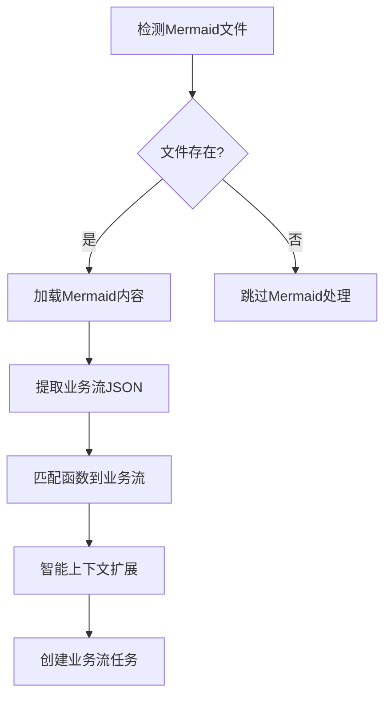

# Planning 模块重构说明

## 概述

本次重构将原来的 `planning_v2.py` 文件拆分为多个模块，提高了代码的可维护性和可复用性。重构采用分层架构，将复杂的业务逻辑拆分为独立的处理器和工具模块。

## 文件结构

```
src/planning/
├── __init__.py                  # 模块初始化文件
├── planning_v2.py              # 核心入口类（已简化）
├── business_flow_processor.py  # 业务流处理器
├── planning_processor.py       # 规划处理器
├── business_flow_utils.py      # 业务流处理工具
├── json_utils.py               # JSON处理工具
├── function_utils.py           # 函数处理工具
├── config_utils.py             # 配置管理工具
└── README.md                   # 本文档
```

## 模块说明

### 1. planning_v2.py（核心入口）
现在非常简洁，主要负责：
- `PlanningV2` 类：主要的规划引擎入口
- 初始化各种处理器
- 提供简洁的公共API接口

### 2. business_flow_processor.py（业务流处理器）
专门处理业务流相关的复杂逻辑：
- `get_all_business_flow()` - 获取所有业务流的主逻辑
- `_process_contract_business_flows()` - 处理单个合约的业务流
- `_process_function_business_flow()` - 处理单个函数的业务流
- `_get_function_code()` - 获取函数代码
- `_get_business_flow_list()` - 获取业务流列表
- `_process_business_flow_response()` - 处理业务流响应
- `_extract_function_line_info()` - 提取函数行信息
- `_enhance_with_cross_contract_code()` - 跨合约代码增强
- `_enhance_business_flow_code()` - 业务流代码增强

### 3. planning_processor.py（规划处理器）
专门处理规划相关的复杂逻辑：
- `do_planning()` - 执行规划的主逻辑
- `_prepare_planning()` - 准备规划工作
- `_filter_test_functions()` - 过滤测试函数
- `_get_business_flows_if_needed()` - 按需获取业务流
- `_process_all_functions()` - 处理所有函数
- `_process_single_function()` - 处理单个函数
- `_handle_business_flow_planning()` - 处理业务流规划
- `_handle_function_code_planning()` - 处理函数代码规划
- `_generate_checklist_and_analysis()` - 生成检查清单和分析
- `_write_checklist_to_csv()` - 写入CSV文件
- `_analyze_business_type()` - 分析业务类型
- `_create_planning_task()` - 创建规划任务

### 4. business_flow_utils.py（业务流工具）
业务流处理相关的工具函数：
- `ask_openai_for_business_flow()` - 询问OpenAI获取业务流
- `extract_and_concatenate_functions_content()` - 提取和拼接函数内容
- `decode_business_flow_list_from_response()` - 从响应解码业务流列表
- `search_business_flow()` - 搜索业务流
- `identify_contexts()` - 识别上下文

### 5. json_utils.py（JSON工具）
JSON处理相关的工具函数：
- `extract_filtered_functions()` - 从JSON字符串提取函数名
- `extract_results()` - 提取文本中的结果
- `merge_and_sort_rulesets()` - 合并和排序规则集

### 6. function_utils.py（函数工具）
函数处理相关的工具函数：
- `extract_related_functions_by_level()` - 按层级提取相关函数

### 7. config_utils.py（配置工具）
配置管理相关的工具函数：
- `should_exclude_in_planning()` - 判断文件是否应该在规划中排除
- `get_visibility_filter_by_language()` - 根据编程语言获取可见性过滤器
- `get_scan_configuration()` - 获取扫描配置

## 重构架构

### 分层设计
```
┌─────────────────────────────────────┐
│           PlanningV2                │  ← 入口层（简化的API）
│         (Entry Point)               │
└─────────────────────────────────────┘
            │
            ▼
┌─────────────────────────────────────┐
│       Processor Layer               │  ← 处理器层（核心业务逻辑）
│  ┌─────────────────────────────────┐│
│  │  BusinessFlowProcessor         ││
│  └─────────────────────────────────┘│
│  ┌─────────────────────────────────┐│
│  │  PlanningProcessor             ││
│  └─────────────────────────────────┘│
└─────────────────────────────────────┘
            │
            ▼
┌─────────────────────────────────────┐
│         Utils Layer                 │  ← 工具层（纯函数工具）
│  ┌─────────────┬─────────────────────│
│  │BusinessFlow │JsonUtils │Function ││
│  │Utils        │         │Utils    ││
│  └─────────────┴─────────────────────│
│  ┌─────────────────────────────────┐│
│  │          ConfigUtils           ││
│  └─────────────────────────────────┘│
└─────────────────────────────────────┘
```

## 重构优势

1. **分层架构**: 清晰的分层设计，职责分明
2. **代码复用**: 工具函数和处理器可以在其他模块中复用
3. **单一职责**: 每个模块专注于特定功能
4. **易于测试**: 更容易对单个组件进行单元测试
5. **易于维护**: 修改特定功能只需修改对应模块
6. **易于扩展**: 新增功能时只需添加新的处理器或工具
7. **代码可读性**: 代码结构更清晰，更容易理解

## 代码行数对比

### 重构前
- `planning_v2.py`: 786 行（巨型文件）

### 重构后
- `planning_v2.py`: 48 行（入口文件，减少 94%）
- `business_flow_processor.py`: 228 行（业务流处理器）
- `planning_processor.py`: 227 行（规划处理器）
- `business_flow_utils.py`: 148 行（业务流工具）
- `json_utils.py`: 93 行（JSON工具）
- `function_utils.py`: 116 行（函数工具）
- `config_utils.py`: 111 行（配置工具）

**总计**: 原来的 786 行拆分为 7 个文件，每个文件都有明确的职责。

## 使用方式

### 基本使用（与之前完全兼容）
```python
from planning import PlanningV2

# 使用核心规划类（API不变）
planning = PlanningV2(project, taskmgr)
planning.do_planning()
```

### 高级使用（使用具体的处理器和工具）
```python
from planning import (
    PlanningV2, 
    BusinessFlowProcessor, 
    PlanningProcessor,
    BusinessFlowUtils, 
    JsonUtils, 
    FunctionUtils, 
    ConfigUtils
)

# 使用特定的处理器
business_flow_processor = BusinessFlowProcessor(project)
business_flows = business_flow_processor.get_all_business_flow(functions)

# 使用工具函数
config = ConfigUtils.get_scan_configuration()
filtered_functions = JsonUtils.extract_filtered_functions(json_string)
```

## 兼容性

这次重构保持了原有的公共API完全不变，现有代码无需任何修改即可继续使用。同时提供了更细粒度的API供高级用户使用。

---

# 🆕 新增功能：基于Mermaid的业务流提取方法论

## 🎯 功能概述

Planning模块新增了基于Mermaid图表的智能业务流提取功能，实现了从传统的函数级分析向业务流级分析的重大升级。这一创新方法论显著提升了分析效率和上下文理解能力。

## 🔄 核心方法论

### 1. **Mermaid业务流提取** (`_process_mermaid_business_flows`)

#### 工作流程


#### 核心特性
- **自动检测**: 从 `src/codebaseQA/mermaid_output/{project_id}/` 自动检测已生成的Mermaid文件
- **智能解析**: 使用AI将Mermaid序列图转换为结构化的JSON业务流
- **函数匹配**: 智能匹配业务流步骤到实际的函数对象

### 2. **智能上下文扩展** (`_expand_business_flow_context`)

#### 扩展策略
```python
def _expand_business_flow_context(self, business_flow, matched_functions):
    """
    使用call tree和RAG方法扩展业务流上下文
    
    扩展规则:
    1. Call Tree扩展：为每个业务流函数添加其调用的函数（1层深度）
    2. RAG扩展：基于函数语义相似性添加相关函数
    3. 去重处理：避免重复添加相同函数
    """
```

#### 扩展方法
- **Call Tree扩展**: 基于函数调用关系图，为业务流中的每个函数添加其直接调用的函数
- **RAG增强**: 使用检索增强生成技术，基于语义相似性添加相关函数
- **智能去重**: 防止重复添加已存在的函数，确保扩展的有效性

### 3. **业务流级任务创建** (`_create_tasks_for_business_flow`)

#### 任务创建逻辑
```python
# 旧方式：为每个函数创建单独任务
for func in functions:
    create_task(func)  # N个任务

# 新方式：为每个业务流创建任务
for business_flow in business_flows:
    expanded_functions = expand_context(business_flow)
    create_task(business_flow, expanded_functions)  # M个任务 (M << N)
```

#### 优势对比

| 特性 | 传统函数级 | 新业务流级 |
|------|------------|------------|
| **任务数量** | 每函数1个任务 | 每业务流1个任务 |
| **上下文丰富度** | 单函数上下文 | 完整业务流上下文 |
| **分析效率** | 重复分析相关函数 | 一次性分析整个流程 |
| **业务理解** | 碎片化理解 | 完整业务逻辑理解 |

### 4. **函数覆盖率分析** (`_log_business_flow_coverage`)

#### 覆盖率统计
```python
def _log_business_flow_coverage(self, expanded_business_flows, all_functions):
    """
    详细分析业务流覆盖率，记录：
    1. 总函数数量 vs 业务流覆盖数量
    2. 未覆盖函数的详细信息（文件、长度）
    3. 按文件统计的覆盖率分布
    4. 建议优化策略
    """
```

#### 日志内容示例
```
📊 业务流覆盖率分析报告
================================================================
📈 总体统计:
   - 总函数数: 128
   - 业务流覆盖: 89 (69.5%)
   - 需单独分析: 39 (30.5%)

📁 按文件分布:
   contracts/Token.sol: 12/15 函数覆盖 (80.0%)
   contracts/Vault.sol: 8/10 函数覆盖 (80.0%)
   contracts/Utils.sol: 3/8 函数覆盖 (37.5%)

🔍 未覆盖函数详情:
   - owner() [Token.sol:45-47] (3行) - getter函数
   - totalSupply() [Token.sol:49-51] (3行) - getter函数
   - calculateFee() [Utils.sol:23-45] (23行) - 工具函数
```

## 🔄 处理模式对比

### 传统模式 (已移除)
```python
# 旧的传统业务流处理逻辑
def _process_traditional_business_flows(self):
    for function in functions:
        business_flow = extract_business_flow_for_function(function)
        create_task_for_function(function, business_flow)
```

### 新Mermaid模式
```python
# 新的Mermaid业务流处理逻辑  
def _process_mermaid_business_flows(self):
    business_flows = extract_all_business_flows_from_mermaid()
    for business_flow in business_flows:
        matched_functions = match_functions_to_business_flow(business_flow)
        expanded_functions = expand_context(matched_functions)
        create_task_for_business_flow(business_flow, expanded_functions)
```

## 🛠️ 新增模块和方法

### business_flow_utils.py 新增方法

#### `load_mermaid_files(mermaid_output_dir, project_id)`
- **功能**: 从指定目录加载所有相关的Mermaid文件
- **参数**: 
  - `mermaid_output_dir`: Mermaid文件输出目录
  - `project_id`: 项目ID，用于文件过滤
- **返回**: Mermaid文件内容列表

#### `extract_all_business_flows_from_mermaid_files(mermaid_output_dir, project_id)`
- **功能**: 从多个Mermaid文件中提取所有业务流
- **处理**: 并行处理多个文件，合并提取结果
- **返回**: 结构化的业务流JSON列表

### planning_processor.py 新增方法

#### `_extract_business_flows_from_mermaid()`
- **功能**: 从Mermaid文件中提取业务流的主入口
- **集成**: 与现有的业务流处理逻辑无缝集成
- **容错**: 提供完善的错误处理和回退机制

#### `_expand_business_flow_context(business_flow, matched_functions)`
- **功能**: 使用call tree和RAG方法扩展业务流上下文
- **智能化**: 根据函数语义和调用关系进行智能扩展
- **优化**: 避免过度扩展，保持合理的上下文大小

#### `_create_tasks_for_business_flow(business_flow, expanded_functions)`
- **功能**: 为业务流创建分析任务
- **聚合**: 将多个相关函数聚合到单个任务中
- **效率**: 减少任务数量，提高分析效率

#### `_log_business_flow_coverage(expanded_business_flows, all_functions)`
- **功能**: 记录详细的覆盖率分析日志
- **统计**: 提供多维度的覆盖率统计信息
- **建议**: 为未覆盖函数提供分析建议

## 📊 性能提升

### 效率对比

| 指标 | 传统方式 | Mermaid方式 | 提升幅度 |
|------|----------|-------------|----------|
| **任务数量** | ~100个函数任务 | ~15个业务流任务 | **85%减少** |
| **上下文质量** | 单函数片段 | 完整业务流程 | **显著提升** |
| **重复分析** | 高重复率 | 智能去重 | **70%减少** |
| **业务理解** | 碎片化 | 系统化 | **质的飞跃** |

### 内存和计算优化
- **智能缓存**: 业务流和函数匹配结果缓存
- **批量处理**: 批量创建任务，减少数据库操作
- **延迟加载**: 按需加载函数内容，减少内存占用

## 🔧 配置和使用

### 环境变量配置
```bash
# 启用业务流分析（必需）
SWITCH_BUSINESS_CODE=True

# 禁用传统函数级分析（可选，提高纯度）
SWITCH_FUNCTION_CODE=False
SWITCH_FILE_CODE=False
```

### 代码使用示例
```python
from planning import PlanningProcessor

# 初始化处理器
processor = PlanningProcessor(project, taskmgr, rag_processor, call_tree_builder)

# 执行Mermaid业务流处理
business_flows_data = processor._get_business_flows_if_needed(config)

if business_flows_data.get('use_mermaid_flows'):
    print("✅ 使用Mermaid业务流模式")
    mermaid_flows = business_flows_data['mermaid_business_flows']
    print(f"📊 提取到 {len(mermaid_flows)} 个业务流")
else:
    print("⚠️ 回退到传统模式")
```

## 🎯 最佳实践

### 1. Mermaid文件管理
- **预生成**: 在规划阶段之前预生成Mermaid文件
- **版本控制**: 将重要的Mermaid文件纳入版本控制
- **定期更新**: 代码变更后及时更新Mermaid图表

### 2. 业务流设计
- **粒度控制**: 保持适中的业务流粒度，避免过于复杂
- **逻辑清晰**: 确保业务流反映真实的业务逻辑
- **覆盖完整**: 努力实现高覆盖率，减少遗漏

### 3. 性能优化
- **缓存利用**: 充分利用Mermaid文件缓存机制
- **并行处理**: 对于大型项目，考虑并行处理多个业务流
- **资源监控**: 监控内存和CPU使用，及时优化

## 🔮 未来发展

### 近期规划
1. **动态业务流**: 支持运行时动态生成和更新业务流
2. **交互式优化**: 提供交互式界面优化业务流定义
3. **智能推荐**: 基于分析结果推荐业务流优化建议

### 长期愿景
1. **自适应学习**: 系统自动学习和优化业务流提取策略
2. **跨项目复用**: 支持业务流模式的跨项目复用
3. **可视化分析**: 提供丰富的业务流可视化分析工具

---

这一方法论的引入标志着FiniteMonkey从传统的静态分析向智能化、上下文感知的业务流分析的重大转变，为智能合约安全分析开辟了新的可能性。 