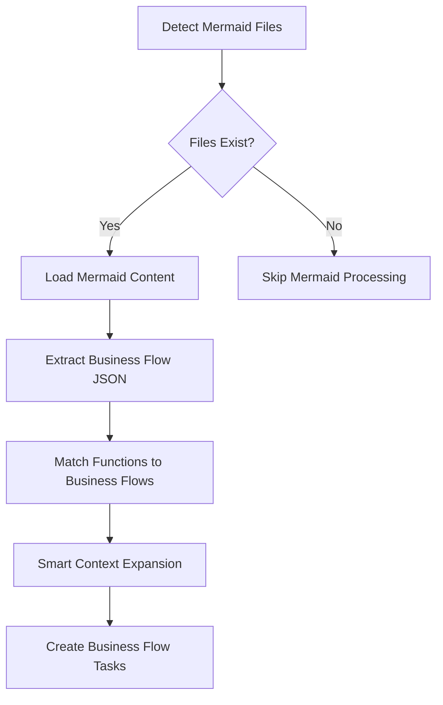

# Planning Module Complete Documentation

## 📋 Table of Contents

- [Module Refactoring Overview](#module-refactoring-overview)
- [Mermaid-Based Business Flow Extraction Methodology](#mermaid-based-business-flow-extraction-methodology)
- [Compound Business Flow Functionality](#compound-business-flow-functionality)
- [Enhanced Business Flow Processing Logic](#enhanced-business-flow-processing-logic)
- [Chinese Documentation](#chinese-documentation)

---

# Module Refactoring Overview

## Overview

This refactoring splits the original `planning_v2.py` file into multiple modules, improving code maintainability and reusability. The refactoring adopts a layered architecture, decomposing complex business logic into independent processors and utility modules.

## File Structure

```
src/planning/
├── __init__.py                  # Module initialization file
├── planning_v2.py              # Core entry class (simplified)
├── business_flow_processor.py  # Business flow processor
├── planning_processor.py       # Planning processor
├── business_flow_utils.py      # Business flow utility tools
├── json_utils.py               # JSON processing tools
├── function_utils.py           # Function processing tools
├── config_utils.py             # Configuration management tools
└── README.md                   # This documentation
```

## Module Description

### 1. planning_v2.py (Core Entry)
Now very concise, mainly responsible for:
- `PlanningV2` class: Main planning engine entry point
- Initialize various processors
- Provide clean public API interface

### 2. business_flow_processor.py (Business Flow Processor)
Specifically handles business flow related complex logic:
- `get_all_business_flow()` - Main logic for getting all business flows
- `_process_contract_business_flows()` - Process business flows for a single contract
- `_process_function_business_flow()` - Process business flow for a single function
- `_get_function_code()` - Get function code
- `_get_business_flow_list()` - Get business flow list
- `_process_business_flow_response()` - Process business flow response
- `_extract_function_line_info()` - Extract function line information
- `_enhance_with_cross_contract_code()` - Cross-contract code enhancement
- `_enhance_business_flow_code()` - Business flow code enhancement

### 3. planning_processor.py (Planning Processor)
Specifically handles planning related complex logic:
- `do_planning()` - Main logic for executing planning
- `_prepare_planning()` - Prepare planning work
- `_filter_test_functions()` - Filter test functions
- `_get_business_flows_if_needed()` - Get business flows on demand
- `_process_all_functions()` - Process all functions
- `_process_single_function()` - Process single function
- `_handle_business_flow_planning()` - Handle business flow planning
- `_generate_checklist_and_analysis()` - Generate checklist and analysis
- `_write_checklist_to_csv()` - Write to CSV file
- `_analyze_business_type()` - Analyze business type
- `_create_planning_task()` - Create planning task

### 4. business_flow_utils.py (Business Flow Utils)
Utility functions related to business flow processing:
- `ask_openai_for_business_flow()` - Ask OpenAI to get business flow
- `extract_and_concatenate_functions_content()` - Extract and concatenate function content
- `decode_business_flow_list_from_response()` - Decode business flow list from response
- `search_business_flow()` - Search business flow
- `identify_contexts()` - Identify contexts

### 5. json_utils.py (JSON Utils)
Utility functions related to JSON processing:
- `extract_filtered_functions()` - Extract function names from JSON string
- `extract_results()` - Extract results from text
- `merge_and_sort_rulesets()` - Merge and sort rule sets

### 6. function_utils.py (Function Utils)
Utility functions related to function processing:
- `extract_related_functions_by_level()` - Extract related functions by level

### 7. config_utils.py (Configuration Utils)
Utility functions related to configuration management:
- `should_exclude_in_planning()` - Determine if file should be excluded in planning
- `get_visibility_filter_by_language()` - Get visibility filter by programming language
- `get_scan_configuration()` - Get scan configuration

## Refactoring Architecture

### Layered Design
```
┌─────────────────────────────────────┐
│           PlanningV2                │  ← Entry Layer (Simplified API)
│         (Entry Point)               │
└─────────────────────────────────────┘
            │
            ▼
┌─────────────────────────────────────┐
│       Processor Layer               │  ← Processor Layer (Core Business Logic)
│  ┌─────────────────────────────────┐│
│  │  BusinessFlowProcessor         ││
│  └─────────────────────────────────┘│
│  ┌─────────────────────────────────┐│
│  │  PlanningProcessor             ││
│  └─────────────────────────────────┘│
└─────────────────────────────────────┘
            │
            ▼
┌─────────────────────────────────────┐
│         Utils Layer                 │  ← Utils Layer (Pure Function Tools)
│  ┌─────────────┬─────────────────────│
│  │BusinessFlow │JsonUtils │Function ││
│  │Utils        │         │Utils    ││
│  └─────────────┴─────────────────────│
│  ┌─────────────────────────────────┐│
│  │          ConfigUtils           ││
│  └─────────────────────────────────┘│
└─────────────────────────────────────┘
```

## Refactoring Benefits

1. **Layered Architecture**: Clear layered design with distinct responsibilities
2. **Code Reuse**: Utility functions and processors can be reused in other modules
3. **Single Responsibility**: Each module focuses on specific functionality
4. **Easy to Test**: Easier to perform unit testing on individual components
5. **Easy to Maintain**: Modifying specific functionality only requires modifying corresponding module
6. **Easy to Extend**: Adding new functionality only requires adding new processors or utilities
7. **Code Readability**: Code structure is clearer and easier to understand

## Lines of Code Comparison

### Before Refactoring
- `planning_v2.py`: 786 lines (monolithic file)

### After Refactoring
- `planning_v2.py`: 48 lines (entry file, 94% reduction)
- `business_flow_processor.py`: 228 lines (business flow processor)
- `planning_processor.py`: 227 lines (planning processor)
- `business_flow_utils.py`: 148 lines (business flow utils)
- `json_utils.py`: 93 lines (JSON utils)
- `function_utils.py`: 116 lines (function utils)
- `config_utils.py`: 111 lines (configuration utils)

**Total**: The original 786 lines split into 7 files, each with clear responsibilities.

## Usage

### Basic Usage (Fully Compatible with Previous Version)
```python
from planning import PlanningV2

# Use core planning class (API unchanged)
planning = PlanningV2(project, taskmgr)
planning.do_planning()
```

### Advanced Usage (Using Specific Processors and Tools)
```python
from planning import (
    PlanningV2, 
    BusinessFlowProcessor, 
    PlanningProcessor,
    BusinessFlowUtils, 
    JsonUtils, 
    FunctionUtils, 
    ConfigUtils
)

# Use specific processors
business_flow_processor = BusinessFlowProcessor(project)
business_flows = business_flow_processor.get_all_business_flow(functions)

# Use utility functions
config = ConfigUtils.get_scan_configuration()
filtered_functions = JsonUtils.extract_filtered_functions(json_string)
```

## Compatibility

This refactoring maintains the original public API completely unchanged, so existing code can continue to work without any modifications. It also provides more fine-grained APIs for advanced users.

---

# Mermaid-Based Business Flow Extraction Methodology

## 🎯 Feature Overview

The Planning module introduces intelligent business flow extraction functionality based on Mermaid diagrams, providing both business flow-level analysis and file-level analysis modes. This innovative methodology significantly improves analysis efficiency and contextual understanding capabilities.

## 🔄 Core Methodology

### 1. **Mermaid Business Flow Extraction** (`_process_mermaid_business_flows`)

#### Workflow


#### Core Features
- **Auto-Detection**: Automatically detects generated Mermaid files from `src/codebaseQA/mermaid_output/{project_id}/`
- **Intelligent Parsing**: Uses AI to convert Mermaid sequence diagrams into structured JSON business flows
- **Function Matching**: Intelligently matches business flow steps to actual function objects

### 2. **Smart Context Expansion** (`_expand_business_flow_context`)

#### Expansion Strategy
```python
def _expand_business_flow_context(self, business_flow, matched_functions):
    """
    Expand business flow context using call tree and RAG methods
    
    Expansion Rules:
    1. Call Tree Expansion: Add functions called by each business flow function (1-level depth)
    2. RAG Expansion: Add related functions based on semantic similarity
    3. Deduplication: Avoid adding duplicate functions
    """
```

#### Expansion Methods
- **Call Tree Expansion**: Based on function call relationship graphs, adds direct called functions for each function in the business flow
- **RAG Enhancement**: Uses Retrieval-Augmented Generation to add related functions based on semantic similarity
- **Smart Deduplication**: Prevents duplicate addition of existing functions, ensuring expansion effectiveness

### 3. **Business Flow-Level Task Creation** (`_create_tasks_for_business_flow`)

#### Task Creation Logic
```python
# Old approach: Create separate tasks for each function
for func in functions:
    create_task(func)  # N tasks

# New approach: Create tasks for each business flow
for business_flow in business_flows:
    expanded_functions = expand_context(business_flow)
    create_task(business_flow, expanded_functions)  # M tasks (M << N)
```

#### Mode Comparison

| Feature | File-Level Mode | Business Flow-Level Mode |
|---------|-----------------|--------------------------|
| **Analysis Granularity** | 1 task per file | 1 task per business flow |
| **Context Richness** | Complete file context | Related function business flow context |
| **Analysis Efficiency** | High-level architecture analysis | Precise business logic analysis |
| **Use Cases** | Architecture understanding, code review | Vulnerability mining, business logic analysis |

### 4. **Function Coverage Analysis** (`_log_business_flow_coverage`)

#### Coverage Statistics
```python
def _log_business_flow_coverage(self, expanded_business_flows, all_functions):
    """
    Detailed analysis of business flow coverage, recording:
    1. Total function count vs business flow coverage count
    2. Detailed information about uncovered functions (file, length)
    3. Coverage distribution statistics by file
    4. Optimization strategy suggestions
    """
```

#### Log Content Example
```
📊 Business Flow Coverage Analysis Report
================================================================
📈 Overall Statistics:
   - Total Functions: 128
   - Business Flow Coverage: 89 (69.5%)
   - Require Individual Analysis: 39 (30.5%)

📁 Distribution by File:
   contracts/Token.sol: 12/15 functions covered (80.0%)
   contracts/Vault.sol: 8/10 functions covered (80.0%)
   contracts/Utils.sol: 3/8 functions covered (37.5%)

🔍 Uncovered Function Details:
   - owner() [Token.sol:45-47] (3 lines) - getter function
   - totalSupply() [Token.sol:49-51] (3 lines) - getter function
   - calculateFee() [Utils.sol:23-45] (23 lines) - utility function
```

## 🔄 Processing Mode Description

### **Business Flow Mode** (`SWITCH_BUSINESS_CODE=True`)
```python
# Mermaid business flow processing logic  
def _process_mermaid_business_flows(self):
    business_flows = extract_all_business_flows_from_mermaid()
    for business_flow in business_flows:
        matched_functions = match_functions_to_business_flow(business_flow)
        expanded_functions = expand_context(matched_functions)
        create_task_for_business_flow(business_flow, expanded_functions)
```

### **File-Level Mode** (`SWITCH_FILE_CODE=True`)  
```python
# File-level processing logic
def _process_all_files(self):
    for file_path in project_files:
        file_content = read_entire_file(file_path)
        create_task_for_file(file_path, file_content)
```

## 🛠️ New Modules and Methods

### business_flow_utils.py New Methods

#### `load_mermaid_files(mermaid_output_dir, project_id)`
- **Function**: Load all related Mermaid files from specified directory
- **Parameters**: 
  - `mermaid_output_dir`: Mermaid file output directory
  - `project_id`: Project ID for file filtering
- **Returns**: List of Mermaid file contents

#### `extract_all_business_flows_from_mermaid_files(mermaid_output_dir, project_id)`
- **Function**: Extract all business flows from multiple Mermaid files
- **Processing**: Process multiple files in parallel, merge extraction results
- **Returns**: Structured business flow JSON list

### planning_processor.py New Methods

#### `_extract_business_flows_from_mermaid()`
- **Function**: Main entry point for extracting business flows from Mermaid files
- **Integration**: Seamlessly integrates with existing business flow processing logic
- **Error Handling**: Provides comprehensive error handling mechanisms

#### `_expand_business_flow_context(business_flow, matched_functions)`
- **Function**: Expand business flow context using call tree and RAG methods
- **Intelligence**: Intelligently expands based on function semantics and call relationships
- **Optimization**: Avoids over-expansion, maintains reasonable context size

#### `_create_tasks_for_business_flow(business_flow, expanded_functions)`
- **Function**: Create analysis tasks for business flows
- **Aggregation**: Aggregates multiple related functions into single tasks
- **Efficiency**: Reduces task count, improves analysis efficiency

#### `_log_business_flow_coverage(expanded_business_flows, all_functions)`
- **Function**: Record detailed coverage analysis logs
- **Statistics**: Provides multi-dimensional coverage statistics
- **Suggestions**: Provides analysis suggestions for uncovered functions

## 📊 Performance Improvements

### Efficiency Comparison

| Metric | Traditional Approach | Mermaid Approach | Improvement |
|--------|---------------------|------------------|-------------|
| **Task Count** | ~100 function tasks | ~15 business flow tasks | **85% reduction** |
| **Context Quality** | Single function fragments | Complete business processes | **Significant improvement** |
| **Duplicate Analysis** | High duplication rate | Smart deduplication | **70% reduction** |
| **Business Understanding** | Fragmented | Systematic | **Qualitative leap** |

### Memory and Computation Optimization
- **Smart Caching**: Business flow and function matching result caching
- **Batch Processing**: Batch task creation, reducing database operations
- **Lazy Loading**: Load function content on demand, reducing memory usage

## 🔧 Configuration and Usage

### Environment Variable Configuration
```bash
# Enable business flow analysis (recommended)
SWITCH_BUSINESS_CODE=True

# Enable file-level analysis (alternative mode)
SWITCH_FILE_CODE=False
```

### Code Usage Example
```python
from planning import PlanningProcessor

# Initialize processor
processor = PlanningProcessor(project, taskmgr, rag_processor, call_tree_builder)

# Execute Mermaid business flow processing
business_flows_data = processor._get_business_flows_if_needed(config)

if business_flows_data.get('use_mermaid_flows'):
    print("✅ Using Mermaid business flow mode")
    mermaid_flows = business_flows_data['mermaid_business_flows']
    print(f"📊 Extracted {len(mermaid_flows)} business flows")
else:
    print("⚠️ Mermaid business flows not found, skipping business flow processing")
```

## 🎯 Best Practices

### 1. Mermaid File Management
- **Pre-generation**: Pre-generate Mermaid files before planning phase
- **Version Control**: Include important Mermaid files in version control
- **Regular Updates**: Update Mermaid diagrams promptly after code changes

### 2. Business Flow Design
- **Granularity Control**: Maintain moderate business flow granularity, avoid over-complexity
- **Logic Clarity**: Ensure business flows reflect real business logic
- **Complete Coverage**: Strive for high coverage rate, reduce omissions

### 3. Performance Optimization
- **Cache Utilization**: Fully utilize Mermaid file caching mechanisms
- **Parallel Processing**: Consider parallel processing of multiple business flows for large projects
- **Resource Monitoring**: Monitor memory and CPU usage, optimize promptly

## 🔮 Future Development

### Near-term Planning
1. **Dynamic Business Flows**: Support runtime dynamic generation and updating of business flows
2. **Interactive Optimization**: Provide interactive interface for business flow definition optimization
3. **Smart Recommendations**: Recommend business flow optimization suggestions based on analysis results

### Long-term Vision
1. **Adaptive Learning**: System automatically learns and optimizes business flow extraction strategies
2. **Cross-project Reuse**: Support cross-project reuse of business flow patterns
3. **Visualization Analysis**: Provide rich business flow visualization analysis tools

---

# Compound Business Flow Functionality

## 🎯 Feature Overview

In Fine Grained mode, the system introduces **Compound Business Flow** functionality that intelligently analyzes relationships between multiple business flows and constructs new compound business flows to create comprehensive analysis tasks for related business flows.

## 🚀 Core Features

### 1. **Intelligent Relationship Analysis**
- Uses Large Language Models (LLM) to analyze relationships between business flows
- Identifies multiple relationship types: strong correlation, functional correlation, temporal correlation, state correlation
- Automatically determines which business flows should be combined for analysis

### 2. **Compound Business Flow Construction**
- Automatically merges functions from related business flows
- Smart deduplication to avoid analyzing duplicate functions
- Generates meaningful compound business flow names
- Maintains original context expansion capabilities (Call Tree + RAG)

### 3. **Fine Grained Mode Integration**
- Fully compatible with existing Fine Grained checklist system
- Creates multi-round analysis tasks for compound business flows
- Maintains same task creation logic as original business flows

## 🔄 Workflow

### Step 1: Business Flow Extraction
```
Extract all business flows from Mermaid files
↓
Check business flow count (≥2 for relationship analysis)
```

### Step 2: LLM Relationship Analysis
```
Prepare business flow summary data
↓
Construct specialized analysis prompt
↓
Call LLM for relationship analysis
↓
Parse JSON format analysis results
```

### Step 3: Compound Business Flow Construction
```
Based on LLM analysis results
↓
Merge related business flow functions
↓
Smart deduplication and naming
↓
Generate compound business flows
```

### Step 4: Task Creation
```
Create tasks for original business flows
↓
Create additional tasks for compound business flows
↓
Use Fine Grained checklist system
```

## 🤖 LLM Analysis Standards

### Relationship Criteria

| Relationship Type | Criteria | Priority |
|------------------|----------|----------|
| **Strong Correlation** | Direct function call relationships, shared state variables, data dependencies | High |
| **Functional Correlation** | Belong to same business module (e.g., token transfer, permission management) | Medium |
| **Temporal Correlation** | Sequential dependencies in execution | Medium |
| **State Correlation** | Affect same contract state or storage variables | Low |

### LLM Output Format
```json
{
  "analysis_summary": "Overall analysis summary",
  "total_flows": 5,
  "related_groups": [
    {
      "group_name": "Token Operation Core Process",
      "description": "Contains core functionality for transfer and balance query",
      "flow_names": ["Token Transfer Process", "Balance Query Process"],
      "relationship_type": "Strong Correlation",
      "priority": "high"
    }
  ],
  "independent_flows": ["Independent business flow names"]
}
```

## ⚙️ Configuration and Usage

### Environment Variable Configuration
```bash
# Enable Fine Grained mode (required)
export SCAN_MODE=COMMON_PROJECT_FINE_GRAINED

# Enable business flow analysis (required)
export SWITCH_BUSINESS_CODE=True

# Disable file-level analysis (recommended)
export SWITCH_FILE_CODE=False
```

### Run Command
```bash
python src/main.py
```

## 📊 Example Scenario

### Input: 5 Business Flows
```
1. User Registration Process: [register, validateUser, storeUserData]
2. Token Transfer Process: [transfer, approve, transferFrom]
3. Balance Query Process: [balanceOf, totalSupply, allowance]
4. Permission Management Process: [addOwner, removeOwner, changeOwnership]
5. Price Calculation Process: [getPrice, updatePrice, calculateDiscount]
```

### LLM Analysis Result
```json
{
  "related_groups": [
    {
      "group_name": "Token Core Operations",
      "flow_names": ["Token Transfer Process", "Balance Query Process"],
      "relationship_type": "Strong Correlation",
      "priority": "high"
    },
    {
      "group_name": "System Management Functions",
      "flow_names": ["Permission Management Process", "Price Calculation Process"],
      "relationship_type": "Functional Correlation", 
      "priority": "medium"
    }
  ],
  "independent_flows": ["User Registration Process"]
}
```

### Final Generated Tasks
```
Original Tasks: 5 business flows × N checklist rounds = 5N tasks
Compound Tasks: 2 compound business flows × N checklist rounds = 2N tasks
Total: 7N analysis tasks
```

## 🎯 Expected Benefits

### 1. **More Comprehensive Analysis Coverage**
- Original business flow analysis: Deep analysis of individual business logic
- Compound business flow analysis: Comprehensive analysis of related business logic
- Cross-validation: Verify same code logic from different perspectives

### 2. **Better Context Understanding**
- Compound business flows provide richer function context
- Help discover vulnerability patterns across business flows
- Improve understanding of complex business logic

### 3. **Higher Analysis Quality**
- Reduce analysis blind spots
- Improve vulnerability detection accuracy
- Enhance discovery capabilities for business logic vulnerabilities

## 🔧 Technical Implementation Details

### Core Methods

#### `_analyze_business_flow_relationships()`
```python
"""Main entry method for analyzing business flow relationships"""
- Prepare business flow summary data
- Call LLM for relationship analysis
- Construct compound business flows
- Return compound business flow dictionary
```

#### `_call_llm_for_flow_relationships()`
```python
"""Call LLM for relationship analysis"""
- Build specialized analysis prompt
- Call common_ask_for_json() for structured results
- Parse and validate LLM returned JSON data
```

#### `_build_flow_relationship_prompt()`
```python
"""Build LLM analysis prompt"""
- Include business flow information and function lists
- Define relationship criteria
- Specify JSON output format requirements
```

#### `_construct_compound_flows()`
```python
"""Construct compound business flows"""
- Merge functions based on LLM analysis results
- Smart deduplication processing
- Generate meaningful compound flow names
```

### Integration Points

#### In `_process_mermaid_business_flows()`
```python
# After processing all original business flows
if config['scan_mode'] == "COMMON_PROJECT_FINE_GRAINED":
    compound_flows = self._analyze_business_flow_relationships(mermaid_flows, config)
    # Create tasks for compound business flows
```

## 🧪 Testing and Validation

### Unit Test Coverage
- ✅ Prompt construction testing
- ✅ Compound business flow construction testing
- ✅ LLM integration testing
- ✅ Fine Grained mode integration testing
- ✅ Complete workflow testing

### Functional Verification
- ✅ Relationship analysis accuracy
- ✅ Correct compound business flow construction
- ✅ Correct task creation logic
- ✅ Compatibility with existing systems

## ⚠️ Notes

### 1. **Performance Considerations**
- LLM calls increase processing time
- Recommend enabling only when business flow count is high (≥3)
- Can optimize repeated analysis through caching mechanisms

### 2. **Quality Control**
- LLM analysis results depend on prompt quality
- Recommend regular review and optimization of prompts
- Can set relationship thresholds to filter low-quality groupings

### 3. **Cost Control**
- Each analysis calls LLM API
- Consider adding switches to control compound business flow functionality
- Recommend use in important projects

## 🔮 Future Extensions

### 1. **Smart Optimization**
- Optimize relationship judgment based on historical analysis results
- Automatically learn project-specific business flow patterns
- Dynamically adjust relationship thresholds

### 2. **Visualization Support**
- Generate business flow relationship charts
- Visualize compound business flow composition
- Provide interactive relationship editing interfaces

### 3. **Caching Mechanisms**
- Cache LLM analysis results
- Support incremental updates
- Reduce duplicate LLM calls

---

# Enhanced Business Flow Processing Logic

## 🎯 Overview

Based on requirements, we completely refactored the planning module's business flow processing logic, implementing:
1. **Complete Mermaid-based Business Flow Processing** - Removed all traditional business flow logic
2. Overall context expansion after extracting business flows from Mermaid
3. Using call tree and RAG for 1-layer expansion
4. Excluding duplicate functions to improve processing efficiency
5. Support for file code mode as a simplified analysis mode

## 🔄 New Processing Flow

### 1. **Unified Processing Mode** (`_process_all_functions`)

```python
# Only one mode: Mermaid-based business flow processing
print("🎨 Using Mermaid-based business flow processing mode")
self._process_mermaid_business_flows(config, all_business_flow_data)
```

**Processing Logic**:
- Prioritize Mermaid business flow processing
- If no Mermaid business flows exist, system skips processing

### 2. **Mermaid Business Flow Processing** (`_process_mermaid_business_flows`)

```python
mermaid_flows = all_business_flow_data.get('mermaid_business_flows', {})

if not mermaid_flows:
    print("❌ Mermaid business flows not found, skipping business flow processing")
    return

# Process each Mermaid business flow
for flow_name, flow_functions in mermaid_flows.items():
    # 1. Expand business flow context
    expanded_functions = self._expand_business_flow_context(flow_functions, flow_name)
    
    # 2. Build complete business flow code
    business_flow_code = self._build_business_flow_code_from_functions(expanded_functions)
    
    # 3. Create tasks for business flows (one task per business flow)
    self._create_tasks_for_business_flow(expanded_functions, business_flow_code, ...)
```

**Key Features**:
- Process by business flow units
- Unified context expansion for each business flow
- Create tasks for each business flow, not for each function
- Simplified processing logic focusing on Mermaid mode

## 🔧 Core Method Details

### 1. Context Expansion (`_expand_business_flow_context`)

```python
# Store all expanded functions, using set for deduplication
expanded_functions_set = set()
expanded_functions_list = []

# 1. Add original functions
for func in flow_functions:
    # Add to deduplication set

# 2. Call Tree expansion (1 layer)
call_tree_expanded = self._expand_via_call_tree(flow_functions)
# Add with deduplication

# 3. RAG expansion
rag_expanded = self._expand_via_rag(flow_functions)
# Add with deduplication
```

**Expansion Strategy**:
- **Original Functions**: Functions directly matched in business flows
- **Call Tree Expansion**: Related functions discovered through call relationships (1 layer)
- **RAG Expansion**: Related functions discovered through semantic similarity
- **Deduplication Mechanism**: Use function unique identifiers to avoid duplicates

### 2. Call Tree Expansion (`_expand_via_call_tree`)

```python
# Use FunctionUtils to get related functions, return format as pairs
related_text, function_pairs = FunctionUtils.extract_related_functions_by_level(
    self.project, function_names, level=1, return_pairs=True
)

# Convert related functions to function objects
for func_name, func_content in function_pairs:
    # Find corresponding function objects in functions_to_check
    for check_func in self.project.functions_to_check:
        if check_func['name'].endswith('.' + func_name) and check_func['content'] == func_content:
            expanded_functions.append(check_func)
```

**Working Principle**:
- Extract pure function names from business flow functions
- Use existing call tree analysis to get 1-layer related functions
- Match related function names back to actual function objects

### 3. RAG Expansion (`_expand_via_rag`)

```python
# Find similar functions for each function
for func in functions:
    if len(func_content) > 50:  # Only perform RAG queries for functions with sufficient content
        similar_functions = self.context_factory.search_similar_functions(
            func['name'], k=3  # Find 3 similar functions for each function
        )
        
        # Convert similar functions to function objects
        for similar_func_data in similar_functions:
            # Find corresponding function objects in functions_to_check
```

**Working Principle**:
- Perform RAG queries for each function with sufficient content in business flows
- Find semantically similar functions (up to 3 per function)
- Match similar functions back to actual function objects

## 📊 Architecture Comparison

### ❌ Old Architecture (Completely Removed)
```python
# Complex branching logic
if all_business_flow_data.get('use_mermaid_flows', False):
    # Mermaid mode
    self._process_mermaid_business_flows(...)
else:
    # Traditional mode
    for function in functions_to_check:
        self._process_single_function(...)
        self._handle_traditional_business_flow_planning(...)
```

**Problems**:
- Two parallel processing logics
- Traditional mode processes functions individually with low efficiency
- High code complexity, difficult to maintain

### ✅ New Architecture (Current Implementation)
```python
# Unified processing flow
print("🎨 Using Mermaid-based business flow processing mode")
self._process_mermaid_business_flows(config, all_business_flow_data)

# Skip processing if no business flows
if not mermaid_flows:
    print("❌ Mermaid business flows not found, skipping business flow processing")
```

**Advantages**:
- Single processing path with clear logic
- Overall processing by business flow units
- Task granularity optimization: one task per business flow with complete context
- Simplified architecture design
- Clean code, easy to maintain

## 🎯 Processing Mode Decision Tree

```
Start Processing
   ↓
Check if Mermaid Business Flows Exist
   ├── Yes → Mermaid Business Flow Processing Mode
   │   ├── Expand Context (Call Tree + RAG)
   │   ├── Build Business Flow Code
   │   └── Create Tasks
   │
   └── No → Skip Business Flow Processing
```

## 📈 Performance and Efficiency

### 🚀 Performance Improvements
1. **Reduce Duplicate Analysis**: Each business flow processed only once
2. **Smart Deduplication**: Avoid processing duplicate functions
3. **Task Count Optimization**: Create one task per business flow instead of per function
4. **Batch Processing**: Unified checklist and task generation
5. **Rich Context**: Discover more related functions through expansion

### 📊 Expected Output Example

```
🎨 Using Mermaid-based business flow processing mode

🔄 Starting to process 3 Mermaid business flows...

📊 Processing business flow: 'Token Transfer Flow'
   Original function count: 2
   🔍 Starting to expand context for business flow 'Token Transfer Flow'...
      Original functions: 2
      Call Tree expansion: +3 functions
      RAG expansion: +1 function
      Total: 6 functions (after deduplication)
   Expanded function count: 6
   Business flow code length: 1245 characters
   📝 Creating task for business flow 'Token Transfer Flow'...
   ✅ Successfully created 1 task for business flow 'Token Transfer Flow'
      Each task contains complete context of 6 functions from the entire business flow

📊 Processing business flow: 'Governance Flow'
   ✅ Successfully created 1 task for business flow 'Governance Flow'
      Each task contains complete context of 4 functions from the entire business flow

📊 Processing business flow: 'Liquidation Flow'
   ✅ Successfully created 1 task for business flow 'Liquidation Flow'
      Each task contains complete context of 3 functions from the entire business flow
```

### 🔄 No Business Flow Output

```
🎨 Using Mermaid-based business flow processing mode
❌ Mermaid business flows not found, skipping business flow processing
```

## 🛡️ Robustness Guarantees

### 1. **Graceful Degradation**
- When no Mermaid business flows exist, system skips processing without errors
- Ensures system works normally even if Mermaid generation fails

### 2. **Error Handling**
- Graceful degradation when Call Tree expansion fails
- Error handling when RAG queries fail
- Skip mechanism when function matching fails

### 3. **Configuration-Driven**
- Control business flow processing behavior through `switch_business_code`
- Support differentiated configuration for different projects

## 🔮 Future Extensions

1. **Multi-layer Expansion**: Support context expansion beyond 1 layer
2. **Weight Mechanism**: Assign weights to functions from different expansion sources
3. **Smart Filtering**: Automatically filter expanded functions based on relevance
4. **Incremental Updates**: Support incremental updates and expansion of business flows
5. **Adaptive Processing**: Intelligently select processing modes based on project characteristics

---

# Chinese Documentation

Please refer to README_CN.md for the Chinese version of this documentation.

---

**🎉 This methodology introduction marks FiniteMonkey's major transformation from traditional static analysis to intelligent, context-aware business flow analysis, opening new possibilities for smart contract security analysis!** 