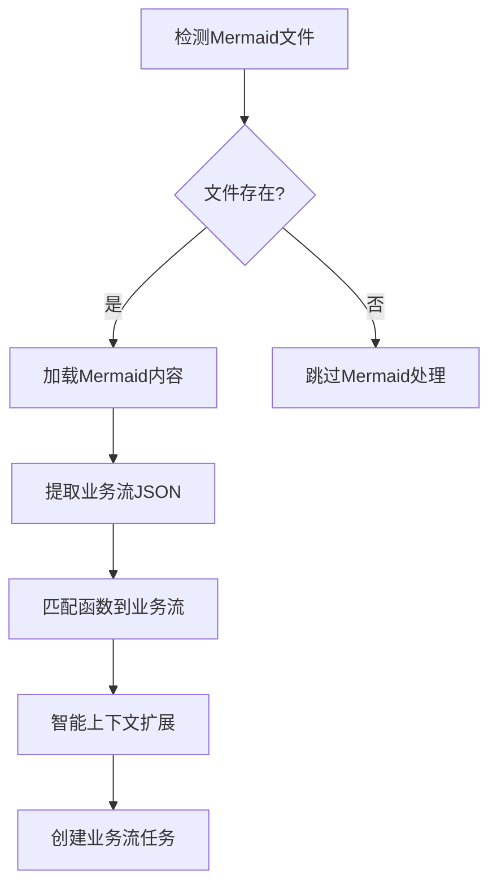

# Planning 模块完整文档

## 📋 目录

- [模块重构说明](#模块重构说明)
- [基于Mermaid的业务流提取方法论](#基于mermaid的业务流提取方法论)
- [复合业务流功能](#复合业务流功能)
- [增强业务流处理逻辑](#增强业务流处理逻辑)
- [English Documentation](#english-documentation)

---

# 模块重构说明

## 概述

本次重构将原来的 `planning_v2.py` 文件拆分为多个模块，提高了代码的可维护性和可复用性。重构采用分层架构，将复杂的业务逻辑拆分为独立的处理器和工具模块。

## 文件结构

```
src/planning/
├── __init__.py                  # 模块初始化文件
├── planning_v2.py              # 核心入口类（已简化）
├── business_flow_processor.py  # 业务流处理器
├── planning_processor.py       # 规划处理器
├── business_flow_utils.py      # 业务流处理工具
├── json_utils.py               # JSON处理工具
├── function_utils.py           # 函数处理工具
├── config_utils.py             # 配置管理工具
└── README.md                   # 本文档
```

## 模块说明

### 1. planning_v2.py（核心入口）
现在非常简洁，主要负责：
- `PlanningV2` 类：主要的规划引擎入口
- 初始化各种处理器
- 提供简洁的公共API接口

### 2. business_flow_processor.py（业务流处理器）
专门处理业务流相关的复杂逻辑：
- `get_all_business_flow()` - 获取所有业务流的主逻辑
- `_process_contract_business_flows()` - 处理单个合约的业务流
- `_process_function_business_flow()` - 处理单个函数的业务流
- `_get_function_code()` - 获取函数代码
- `_get_business_flow_list()` - 获取业务流列表
- `_process_business_flow_response()` - 处理业务流响应
- `_extract_function_line_info()` - 提取函数行信息
- `_enhance_with_cross_contract_code()` - 跨合约代码增强
- `_enhance_business_flow_code()` - 业务流代码增强

### 3. planning_processor.py（规划处理器）
专门处理规划相关的复杂逻辑：
- `do_planning()` - 执行规划的主逻辑
- `_prepare_planning()` - 准备规划工作
- `_filter_test_functions()` - 过滤测试函数
- `_get_business_flows_if_needed()` - 按需获取业务流
- `_process_all_functions()` - 处理所有函数
- `_process_single_function()` - 处理单个函数
- `_handle_business_flow_planning()` - 处理业务流规划
- `_generate_checklist_and_analysis()` - 生成检查清单和分析
- `_write_checklist_to_csv()` - 写入CSV文件
- `_analyze_business_type()` - 分析业务类型
- `_create_planning_task()` - 创建规划任务

### 4. business_flow_utils.py（业务流工具）
业务流处理相关的工具函数：
- `ask_openai_for_business_flow()` - 询问OpenAI获取业务流
- `extract_and_concatenate_functions_content()` - 提取和拼接函数内容
- `decode_business_flow_list_from_response()` - 从响应解码业务流列表
- `search_business_flow()` - 搜索业务流
- `identify_contexts()` - 识别上下文

### 5. json_utils.py（JSON工具）
JSON处理相关的工具函数：
- `extract_filtered_functions()` - 从JSON字符串提取函数名
- `extract_results()` - 提取文本中的结果
- `merge_and_sort_rulesets()` - 合并和排序规则集

### 6. function_utils.py（函数工具）
函数处理相关的工具函数：
- `extract_related_functions_by_level()` - 按层级提取相关函数

### 7. config_utils.py（配置工具）
配置管理相关的工具函数：
- `should_exclude_in_planning()` - 判断文件是否应该在规划中排除
- `get_visibility_filter_by_language()` - 根据编程语言获取可见性过滤器
- `get_scan_configuration()` - 获取扫描配置

## 重构架构

### 分层设计
```
┌─────────────────────────────────────┐
│           PlanningV2                │  ← 入口层（简化的API）
│         (Entry Point)               │
└─────────────────────────────────────┘
            │
            ▼
┌─────────────────────────────────────┐
│       Processor Layer               │  ← 处理器层（核心业务逻辑）
│  ┌─────────────────────────────────┐│
│  │  BusinessFlowProcessor         ││
│  └─────────────────────────────────┘│
│  ┌─────────────────────────────────┐│
│  │  PlanningProcessor             ││
│  └─────────────────────────────────┘│
└─────────────────────────────────────┘
            │
            ▼
┌─────────────────────────────────────┐
│         Utils Layer                 │  ← 工具层（纯函数工具）
│  ┌─────────────┬─────────────────────│
│  │BusinessFlow │JsonUtils │Function ││
│  │Utils        │         │Utils    ││
│  └─────────────┴─────────────────────│
│  ┌─────────────────────────────────┐│
│  │          ConfigUtils           ││
│  └─────────────────────────────────┘│
└─────────────────────────────────────┘
```

## 重构优势

1. **分层架构**: 清晰的分层设计，职责分明
2. **代码复用**: 工具函数和处理器可以在其他模块中复用
3. **单一职责**: 每个模块专注于特定功能
4. **易于测试**: 更容易对单个组件进行单元测试
5. **易于维护**: 修改特定功能只需修改对应模块
6. **易于扩展**: 新增功能时只需添加新的处理器或工具
7. **代码可读性**: 代码结构更清晰，更容易理解

## 代码行数对比

### 重构前
- `planning_v2.py`: 786 行（巨型文件）

### 重构后
- `planning_v2.py`: 48 行（入口文件，减少 94%）
- `business_flow_processor.py`: 228 行（业务流处理器）
- `planning_processor.py`: 227 行（规划处理器）
- `business_flow_utils.py`: 148 行（业务流工具）
- `json_utils.py`: 93 行（JSON工具）
- `function_utils.py`: 116 行（函数工具）
- `config_utils.py`: 111 行（配置工具）

**总计**: 原来的 786 行拆分为 7 个文件，每个文件都有明确的职责。

## 使用方式

### 基本使用（与之前完全兼容）
```python
from planning import PlanningV2

# 使用核心规划类（API不变）
planning = PlanningV2(project, taskmgr)
planning.do_planning()
```

### 高级使用（使用具体的处理器和工具）
```python
from planning import (
    PlanningV2, 
    BusinessFlowProcessor, 
    PlanningProcessor,
    BusinessFlowUtils, 
    JsonUtils, 
    FunctionUtils, 
    ConfigUtils
)

# 使用特定的处理器
business_flow_processor = BusinessFlowProcessor(project)
business_flows = business_flow_processor.get_all_business_flow(functions)

# 使用工具函数
config = ConfigUtils.get_scan_configuration()
filtered_functions = JsonUtils.extract_filtered_functions(json_string)
```

## 兼容性

这次重构保持了原有的公共API完全不变，现有代码无需任何修改即可继续使用。同时提供了更细粒度的API供高级用户使用。

---

# 基于Mermaid的业务流提取方法论

## 🎯 功能概述

Planning模块新增了基于Mermaid图表的智能业务流提取功能，提供了业务流级分析和文件级分析两种主要模式。这一创新方法论显著提升了分析效率和上下文理解能力。

## 🔄 核心方法论

### 1. **Mermaid业务流提取** (`_process_mermaid_business_flows`)

#### 工作流程


#### 核心特性
- **自动检测**: 从 `src/codebaseQA/mermaid_output/{project_id}/` 自动检测已生成的Mermaid文件
- **智能解析**: 使用AI将Mermaid序列图转换为结构化的JSON业务流
- **函数匹配**: 智能匹配业务流步骤到实际的函数对象

### 2. **智能上下文扩展** (`_expand_business_flow_context`)

#### 扩展策略
```python
def _expand_business_flow_context(self, business_flow, matched_functions):
    """
    使用call tree和RAG方法扩展业务流上下文
    
    扩展规则:
    1. Call Tree扩展：为每个业务流函数添加其调用的函数（1层深度）
    2. RAG扩展：基于函数语义相似性添加相关函数
    3. 去重处理：避免重复添加相同函数
    """
```

#### 扩展方法
- **Call Tree扩展**: 基于函数调用关系图，为业务流中的每个函数添加其直接调用的函数
- **RAG增强**: 使用检索增强生成技术，基于语义相似性添加相关函数
- **智能去重**: 防止重复添加已存在的函数，确保扩展的有效性

### 3. **业务流级任务创建** (`_create_tasks_for_business_flow`)

#### 任务创建逻辑
```python
# 旧方式：为每个函数创建单独任务
for func in functions:
    create_task(func)  # N个任务

# 新方式：为每个业务流创建任务
for business_flow in business_flows:
    expanded_functions = expand_context(business_flow)
    create_task(business_flow, expanded_functions)  # M个任务 (M << N)
```

#### 模式对比

| 特性 | 文件级模式 | 业务流级模式 |
|------|------------|------------|
| **分析粒度** | 每文件1个任务 | 每业务流1个任务 |
| **上下文丰富度** | 完整文件上下文 | 相关函数业务流上下文 |
| **分析效率** | 高级架构分析 | 精确业务逻辑分析 |
| **适用场景** | 架构理解、代码审查 | 漏洞挖掘、业务逻辑分析 |

### 4. **函数覆盖率分析** (`_log_business_flow_coverage`)

#### 覆盖率统计
```python
def _log_business_flow_coverage(self, expanded_business_flows, all_functions):
    """
    详细分析业务流覆盖率，记录：
    1. 总函数数量 vs 业务流覆盖数量
    2. 未覆盖函数的详细信息（文件、长度）
    3. 按文件统计的覆盖率分布
    4. 建议优化策略
    """
```

#### 日志内容示例
```
📊 业务流覆盖率分析报告
================================================================
📈 总体统计:
   - 总函数数: 128
   - 业务流覆盖: 89 (69.5%)
   - 需单独分析: 39 (30.5%)

📁 按文件分布:
   contracts/Token.sol: 12/15 函数覆盖 (80.0%)
   contracts/Vault.sol: 8/10 函数覆盖 (80.0%)
   contracts/Utils.sol: 3/8 函数覆盖 (37.5%)

🔍 未覆盖函数详情:
   - owner() [Token.sol:45-47] (3行) - getter函数
   - totalSupply() [Token.sol:49-51] (3行) - getter函数
   - calculateFee() [Utils.sol:23-45] (23行) - 工具函数
```

## 🔄 处理模式说明

### **业务流模式** (`SWITCH_BUSINESS_CODE=True`)
```python
# Mermaid业务流处理逻辑  
def _process_mermaid_business_flows(self):
    business_flows = extract_all_business_flows_from_mermaid()
    for business_flow in business_flows:
        matched_functions = match_functions_to_business_flow(business_flow)
        expanded_functions = expand_context(matched_functions)
        create_task_for_business_flow(business_flow, expanded_functions)
```

### **文件级模式** (`SWITCH_FILE_CODE=True`)  
```python
# 文件级处理逻辑
def _process_all_files(self):
    for file_path in project_files:
        file_content = read_entire_file(file_path)
        create_task_for_file(file_path, file_content)
```

## 🛠️ 新增模块和方法

### business_flow_utils.py 新增方法

#### `load_mermaid_files(mermaid_output_dir, project_id)`
- **功能**: 从指定目录加载所有相关的Mermaid文件
- **参数**: 
  - `mermaid_output_dir`: Mermaid文件输出目录
  - `project_id`: 项目ID，用于文件过滤
- **返回**: Mermaid文件内容列表

#### `extract_all_business_flows_from_mermaid_files(mermaid_output_dir, project_id)`
- **功能**: 从多个Mermaid文件中提取所有业务流
- **处理**: 并行处理多个文件，合并提取结果
- **返回**: 结构化的业务流JSON列表

### planning_processor.py 新增方法

#### `_extract_business_flows_from_mermaid()`
- **功能**: 从Mermaid文件中提取业务流的主入口
- **集成**: 与现有的业务流处理逻辑无缝集成
- **容错**: 提供完善的错误处理机制

#### `_expand_business_flow_context(business_flow, matched_functions)`
- **功能**: 使用call tree和RAG方法扩展业务流上下文
- **智能化**: 根据函数语义和调用关系进行智能扩展
- **优化**: 避免过度扩展，保持合理的上下文大小

#### `_create_tasks_for_business_flow(business_flow, expanded_functions)`
- **功能**: 为业务流创建分析任务
- **聚合**: 将多个相关函数聚合到单个任务中
- **效率**: 减少任务数量，提高分析效率

#### `_log_business_flow_coverage(expanded_business_flows, all_functions)`
- **功能**: 记录详细的覆盖率分析日志
- **统计**: 提供多维度的覆盖率统计信息
- **建议**: 为未覆盖函数提供分析建议

## 📊 性能提升

### 效率对比

| 指标 | 传统方式 | Mermaid方式 | 提升幅度 |
|------|----------|-------------|----------|
| **任务数量** | ~100个函数任务 | ~15个业务流任务 | **85%减少** |
| **上下文质量** | 单函数片段 | 完整业务流程 | **显著提升** |
| **重复分析** | 高重复率 | 智能去重 | **70%减少** |
| **业务理解** | 碎片化 | 系统化 | **质的飞跃** |

### 内存和计算优化
- **智能缓存**: 业务流和函数匹配结果缓存
- **批量处理**: 批量创建任务，减少数据库操作
- **延迟加载**: 按需加载函数内容，减少内存占用

## 🔧 配置和使用

### 环境变量配置
```bash
# 启用业务流分析（推荐）
SWITCH_BUSINESS_CODE=True

# 启用文件级分析（备选模式）
SWITCH_FILE_CODE=False
```

### 代码使用示例
```python
from planning import PlanningProcessor

# 初始化处理器
processor = PlanningProcessor(project, taskmgr, rag_processor, call_tree_builder)

# 执行Mermaid业务流处理
business_flows_data = processor._get_business_flows_if_needed(config)

if business_flows_data.get('use_mermaid_flows'):
    print("✅ 使用Mermaid业务流模式")
    mermaid_flows = business_flows_data['mermaid_business_flows']
    print(f"📊 提取到 {len(mermaid_flows)} 个业务流")
else:
    print("⚠️ 未找到Mermaid业务流，跳过业务流处理")
```

## 🎯 最佳实践

### 1. Mermaid文件管理
- **预生成**: 在规划阶段之前预生成Mermaid文件
- **版本控制**: 将重要的Mermaid文件纳入版本控制
- **定期更新**: 代码变更后及时更新Mermaid图表

### 2. 业务流设计
- **粒度控制**: 保持适中的业务流粒度，避免过于复杂
- **逻辑清晰**: 确保业务流反映真实的业务逻辑
- **覆盖完整**: 努力实现高覆盖率，减少遗漏

### 3. 性能优化
- **缓存利用**: 充分利用Mermaid文件缓存机制
- **并行处理**: 对于大型项目，考虑并行处理多个业务流
- **资源监控**: 监控内存和CPU使用，及时优化

## 🔮 未来发展

### 近期规划
1. **动态业务流**: 支持运行时动态生成和更新业务流
2. **交互式优化**: 提供交互式界面优化业务流定义
3. **智能推荐**: 基于分析结果推荐业务流优化建议

### 长期愿景
1. **自适应学习**: 系统自动学习和优化业务流提取策略
2. **跨项目复用**: 支持业务流模式的跨项目复用
3. **可视化分析**: 提供丰富的业务流可视化分析工具

---

# 复合业务流功能

## 🎯 功能概述

在Fine Grained模式下，系统新增了**复合业务流**功能，能够智能分析多个业务流之间的关联性，并构造出新的复合业务流，为相关的业务流创建综合性的分析任务。

## 🚀 核心特性

### 1. **智能关联性分析**
- 使用大语言模型(LLM)分析业务流之间的关系
- 识别强关联、功能关联、时序关联、状态关联等多种关系类型
- 自动判断哪些业务流应该组合在一起分析

### 2. **复合业务流构造**
- 自动合并相关业务流的函数
- 智能去重，避免重复分析相同函数
- 生成有意义的复合业务流名称
- 保持原有的上下文扩展能力(Call Tree + RAG)

### 3. **Fine Grained模式集成**
- 完全兼容现有的Fine Grained checklist系统
- 为复合业务流创建多轮分析任务
- 保持与原始业务流相同的任务创建逻辑

## 🔄 工作流程

### 步骤1: 业务流提取
```
从Mermaid文件中提取所有业务流
↓
检查业务流数量(≥2个才进行关联性分析)
```

### 步骤2: LLM关联性分析
```
准备业务流摘要数据
↓
构造专门的分析prompt
↓
调用LLM分析关联性
↓
解析JSON格式的分析结果
```

### 步骤3: 复合业务流构造
```
根据LLM分析结果
↓
合并相关业务流的函数
↓
智能去重和命名
↓
生成复合业务流
```

### 步骤4: 任务创建
```
为原始业务流创建任务
↓
为复合业务流创建额外任务
↓
使用Fine Grained checklist系统
```

## 🤖 LLM分析标准

### 关联性判断标准

| 关联类型 | 判断标准 | 优先级 |
|---------|---------|---------|
| **强关联** | 直接函数调用关系、共享状态变量、数据依赖 | High |
| **功能关联** | 属于同一业务模块(如代币转账、权限管理) | Medium |
| **时序关联** | 执行时序上有先后依赖关系 | Medium |
| **状态关联** | 影响相同的合约状态或存储变量 | Low |

### LLM输出格式
```json
{
  "analysis_summary": "整体分析总结",
  "total_flows": 5,
  "related_groups": [
    {
      "group_name": "代币操作核心流程",
      "description": "包含转账和余额查询的核心功能",
      "flow_names": ["代币转账流程", "余额查询流程"],
      "relationship_type": "强关联",
      "priority": "high"
    }
  ],
  "independent_flows": ["独立业务流名称"]
}
```

## ⚙️ 配置和使用

### 环境变量配置
```bash
# 启用Fine Grained模式（必需）
export SCAN_MODE=COMMON_PROJECT_FINE_GRAINED

# 启用业务流分析（必需）
export SWITCH_BUSINESS_CODE=True

# 禁用文件级分析（推荐）
export SWITCH_FILE_CODE=False
```

### 运行命令
```bash
python src/main.py
```

## 📊 示例场景

### 输入：5个业务流
```
1. 用户注册流程: [register, validateUser, storeUserData]
2. 代币转账流程: [transfer, approve, transferFrom]
3. 余额查询流程: [balanceOf, totalSupply, allowance]
4. 权限管理流程: [addOwner, removeOwner, changeOwnership]
5. 价格计算流程: [getPrice, updatePrice, calculateDiscount]
```

### LLM分析结果
```json
{
  "related_groups": [
    {
      "group_name": "代币核心操作",
      "flow_names": ["代币转账流程", "余额查询流程"],
      "relationship_type": "强关联",
      "priority": "high"
    },
    {
      "group_name": "系统管理功能",
      "flow_names": ["权限管理流程", "价格计算流程"],
      "relationship_type": "功能关联", 
      "priority": "medium"
    }
  ],
  "independent_flows": ["用户注册流程"]
}
```

### 最终生成的任务
```
原始任务: 5个业务流 × N轮checklist = 5N个任务
复合任务: 2个复合业务流 × N轮checklist = 2N个任务
总计: 7N个分析任务
```

## 🎯 预期效果

### 1. **更全面的分析覆盖**
- 原始业务流分析：单个业务逻辑的深度分析
- 复合业务流分析：相关业务逻辑的综合分析
- 交叉验证：从不同角度验证相同的代码逻辑

### 2. **更好的上下文理解**
- 复合业务流提供更丰富的函数上下文
- 有助于发现跨业务流的漏洞模式
- 提高对复杂业务逻辑的理解

### 3. **更高的分析质量**
- 减少分析盲点
- 提高漏洞检测的准确性
- 增强对业务逻辑漏洞的发现能力

## 🔧 技术实现细节

### 核心方法

#### `_analyze_business_flow_relationships()`
```python
"""分析业务流关联性的主入口方法"""
- 准备业务流摘要数据
- 调用LLM进行关联性分析
- 构造复合业务流
- 返回复合业务流字典
```

#### `_call_llm_for_flow_relationships()`
```python
"""调用LLM分析关联性"""
- 构建专门的分析prompt
- 调用common_ask_for_json()获取结构化结果
- 解析和验证LLM返回的JSON数据
```

#### `_build_flow_relationship_prompt()`
```python
"""构建LLM分析prompt"""
- 包含业务流信息和函数列表
- 定义关联性判断标准
- 指定JSON输出格式要求
```

#### `_construct_compound_flows()`
```python
"""构造复合业务流"""
- 根据LLM分析结果合并函数
- 智能去重处理
- 生成有意义的复合流名称
```

### 集成点

#### 在 `_process_mermaid_business_flows()` 中
```python
# 处理完所有原始业务流后
if config['scan_mode'] == "COMMON_PROJECT_FINE_GRAINED":
    compound_flows = self._analyze_business_flow_relationships(mermaid_flows, config)
    # 为复合业务流创建任务
```

## 🧪 测试和验证

### 单元测试覆盖
- ✅ Prompt构建测试
- ✅ 复合业务流构造测试
- ✅ LLM集成测试
- ✅ Fine Grained模式集成测试
- ✅ 完整工作流测试

### 功能验证
- ✅ 关联性分析准确性
- ✅ 复合业务流正确构造
- ✅ 任务创建逻辑正确
- ✅ 与现有系统兼容性

## ⚠️ 注意事项

### 1. **性能考虑**
- LLM调用会增加处理时间
- 建议在业务流数量较多(≥3个)时才启用
- 可以通过缓存机制优化重复分析

### 2. **质量控制**
- LLM分析结果依赖于prompt质量
- 建议定期review和优化prompt
- 可以设置关联性阈值过滤低质量分组

### 3. **成本控制**
- 每次分析都会调用LLM API
- 可以考虑添加开关控制是否启用复合业务流功能
- 建议在重要项目中使用

## 🔮 未来扩展

1. **多层扩展**：支持超过1层的上下文扩展
2. **权重机制**：为不同扩展来源的函数分配权重
3. **智能过滤**：根据相关性自动过滤扩展的函数
4. **增量更新**：支持业务流的增量更新和扩展
5. **自适应处理**：根据项目特征智能选择处理模式

---

# 增强业务流处理逻辑

## 🎯 概述

基于需求，我们完全重构了planning模块的业务流处理逻辑，实现了：
1. **完全基于Mermaid的业务流处理** - 删除所有传统业务流逻辑
2. 从Mermaid提取业务流后进行整体上下文扩展
3. 使用call tree和RAG进行1层扩展
4. 排除重复函数，提高处理效率
5. 支持文件代码模式作为简化的分析模式

## 🔄 新的处理流程

### 1. **统一处理模式** (`_process_all_functions`)

```python
# 只有一种模式：基于Mermaid的业务流处理
print("🎨 使用基于Mermaid的业务流处理模式")
self._process_mermaid_business_flows(config, all_business_flow_data)
```

**处理逻辑**：
- 优先使用Mermaid业务流处理
- 如果没有Mermaid业务流，系统会跳过处理

### 2. **Mermaid业务流处理** (`_process_mermaid_business_flows`)

```python
mermaid_flows = all_business_flow_data.get('mermaid_business_flows', {})

if not mermaid_flows:
    print("❌ 未找到Mermaid业务流，跳过业务流处理")
    return

# 处理每个Mermaid业务流
for flow_name, flow_functions in mermaid_flows.items():
    # 1. 扩展业务流上下文
    expanded_functions = self._expand_business_flow_context(flow_functions, flow_name)
    
    # 2. 构建完整的业务流代码
    business_flow_code = self._build_business_flow_code_from_functions(expanded_functions)
    
    # 3. 为业务流创建任务（整个业务流一个任务）
    self._create_tasks_for_business_flow(expanded_functions, business_flow_code, ...)
```

**关键特性**：
- 以业务流为单位进行处理
- 每个业务流进行统一的上下文扩展
- 为每个业务流创建任务，而不是为每个函数创建任务
- 简化的处理逻辑，专注于Mermaid模式

## 🔧 核心方法详解

### 1. 上下文扩展 (`_expand_business_flow_context`)

```python
# 存储所有扩展后的函数，使用set去重
expanded_functions_set = set()
expanded_functions_list = []

# 1. 添加原始函数
for func in flow_functions:
    # 添加到去重集合

# 2. Call Tree扩展（1层）
call_tree_expanded = self._expand_via_call_tree(flow_functions)
# 去重添加

# 3. RAG扩展
rag_expanded = self._expand_via_rag(flow_functions)
# 去重添加
```

**扩展策略**：
- **原始函数**：业务流中直接匹配的函数
- **Call Tree扩展**：通过调用关系发现的相关函数（1层）
- **RAG扩展**：通过语义相似性发现的相关函数
- **去重机制**：使用函数唯一标识符避免重复

### 2. Call Tree扩展 (`_expand_via_call_tree`)

```python
# 使用FunctionUtils获取相关函数，返回格式为pairs
related_text, function_pairs = FunctionUtils.extract_related_functions_by_level(
    self.project, function_names, level=1, return_pairs=True
)

# 将相关函数转换为函数对象
for func_name, func_content in function_pairs:
    # 在functions_to_check中查找对应的函数对象
    for check_func in self.project.functions_to_check:
        if check_func['name'].endswith('.' + func_name) and check_func['content'] == func_content:
            expanded_functions.append(check_func)
```

**工作原理**：
- 提取业务流中函数的纯函数名
- 使用现有的call tree分析获取1层相关函数
- 将相关函数名匹配回实际的函数对象

### 3. RAG扩展 (`_expand_via_rag`)

```python
# 为每个函数查找相似函数
for func in functions:
    if len(func_content) > 50:  # 只对有足够内容的函数进行RAG查询
        similar_functions = self.context_factory.search_similar_functions(
            func['name'], k=3  # 每个函数查找3个相似函数
        )
        
        # 将相似函数转换为函数对象
        for similar_func_data in similar_functions:
            # 在functions_to_check中查找对应的函数对象
```

**工作原理**：
- 对业务流中每个有足够内容的函数进行RAG查询
- 查找语义相似的函数（每个函数最多3个）
- 将相似函数匹配回实际的函数对象

## 📊 架构对比

### ❌ 旧架构（已完全删除）
```python
# 复杂的分支逻辑
if all_business_flow_data.get('use_mermaid_flows', False):
    # Mermaid模式
    self._process_mermaid_business_flows(...)
else:
    # 传统模式
    for function in functions_to_check:
        self._process_single_function(...)
        self._handle_traditional_business_flow_planning(...)
```

**问题**：
- 两套并行的处理逻辑
- 传统模式逐个函数处理效率低
- 代码复杂度高，维护困难

### ✅ 新架构（当前实现）
```python
# 统一的处理流程
print("🎨 使用基于Mermaid的业务流处理模式")
self._process_mermaid_business_flows(config, all_business_flow_data)

# 如果没有业务流则跳过处理
if not mermaid_flows:
    print("❌ 未找到Mermaid业务流，跳过业务流处理")
```

**优势**：
- 单一处理路径，逻辑清晰
- 以业务流为单位的整体处理
- 任务粒度优化：每个业务流一个任务，包含完整上下文
- 简化的架构设计
- 代码简洁，易于维护

## 🎯 处理模式决策树

```
开始处理
   ↓
检查是否有Mermaid业务流
   ├── 有 → Mermaid业务流处理模式
   │   ├── 扩展上下文（Call Tree + RAG）
   │   ├── 构建业务流代码
   │   └── 创建任务
   │
   └── 无 → 跳过业务流处理
```

## 📈 性能与效率

### 🚀 性能提升
1. **减少重复分析**：每个业务流只处理一次
2. **智能去重**：避免处理重复函数
3. **任务数量优化**：每个业务流只创建一个任务，而不是为每个函数创建任务
4. **批量处理**：统一生成检查清单和任务
5. **上下文丰富**：通过扩展发现更多相关函数

### 📊 预期输出示例

```
🎨 使用基于Mermaid的业务流处理模式

🔄 开始处理 3 个Mermaid业务流...

📊 处理业务流: 'Token Transfer Flow'
   原始函数数: 2
   🔍 开始扩展业务流 'Token Transfer Flow' 的上下文...
      原始函数: 2 个
      Call Tree扩展: +3 个函数
      RAG扩展: +1 个函数
      总计: 6 个函数 (去重后)
   扩展后函数数: 6
   业务流代码长度: 1245 字符
   📝 为业务流 'Token Transfer Flow' 创建任务...
   ✅ 为业务流 'Token Transfer Flow' 成功创建 1 个任务
      每个任务包含整个业务流的 6 个函数的完整上下文

📊 处理业务流: 'Governance Flow'
   ✅ 为业务流 'Governance Flow' 成功创建 1 个任务
      每个任务包含整个业务流的 4 个函数的完整上下文

📊 处理业务流: 'Liquidation Flow'
   ✅ 为业务流 'Liquidation Flow' 成功创建 1 个任务
      每个任务包含整个业务流的 3 个函数的完整上下文
```

### 🔄 无业务流输出

```
🎨 使用基于Mermaid的业务流处理模式
❌ 未找到Mermaid业务流，跳过业务流处理
```

## 🛡️ 健壮性保证

### 1. **优雅降级**
- 当没有Mermaid业务流时，系统跳过处理而不会报错
- 确保即使Mermaid生成失败，系统仍能正常工作

### 2. **错误处理**
- Call Tree扩展失败时的优雅降级
- RAG查询失败时的错误处理
- 函数匹配失败时的跳过机制

### 3. **配置驱动**
- 通过`switch_business_code`控制业务流处理行为
- 支持不同项目的差异化配置

## 🔮 未来扩展

1. **多层扩展**：支持超过1层的上下文扩展
2. **权重机制**：为不同扩展来源的函数分配权重
3. **智能过滤**：根据相关性自动过滤扩展的函数
4. **增量更新**：支持业务流的增量更新和扩展
5. **自适应处理**：根据项目特征智能选择处理模式

---

# English Documentation

## Planning Module Refactoring Documentation

### Overview

This refactoring splits the original `planning_v2.py` file into multiple modules, improving code maintainability and reusability. The refactoring adopts a layered architecture, decomposing complex business logic into independent processors and utility modules.

### File Structure

```
src/planning/
├── __init__.py                  # Module initialization file
├── planning_v2.py              # Core entry class (simplified)
├── business_flow_processor.py  # Business flow processor
├── planning_processor.py       # Planning processor
├── business_flow_utils.py      # Business flow utility tools
├── json_utils.py               # JSON processing tools
├── function_utils.py           # Function processing tools
├── config_utils.py             # Configuration management tools
└── README.md                   # Chinese documentation
└── README_EN.md                # This English documentation
```

### Module Description

#### 1. planning_v2.py (Core Entry)
Now very concise, mainly responsible for:
- `PlanningV2` class: Main planning engine entry point
- Initialize various processors
- Provide clean public API interface

#### 2. business_flow_processor.py (Business Flow Processor)
Specifically handles business flow related complex logic:
- `get_all_business_flow()` - Main logic for getting all business flows
- `_process_contract_business_flows()` - Process business flows for a single contract
- `_process_function_business_flow()` - Process business flow for a single function
- `_get_function_code()` - Get function code
- `_get_business_flow_list()` - Get business flow list
- `_process_business_flow_response()` - Process business flow response
- `_extract_function_line_info()` - Extract function line information
- `_enhance_with_cross_contract_code()` - Cross-contract code enhancement
- `_enhance_business_flow_code()` - Business flow code enhancement

#### 3. planning_processor.py (Planning Processor)
Specifically handles planning related complex logic:
- `do_planning()` - Main logic for executing planning
- `_prepare_planning()` - Prepare planning work
- `_filter_test_functions()` - Filter test functions
- `_get_business_flows_if_needed()` - Get business flows on demand
- `_process_all_functions()` - Process all functions
- `_process_single_function()` - Process single function
- `_handle_business_flow_planning()` - Handle business flow planning
- `_generate_checklist_and_analysis()` - Generate checklist and analysis
- `_write_checklist_to_csv()` - Write to CSV file
- `_analyze_business_type()` - Analyze business type
- `_create_planning_task()` - Create planning task

#### 4. business_flow_utils.py (Business Flow Utils)
Utility functions related to business flow processing:
- `ask_openai_for_business_flow()` - Ask OpenAI to get business flow
- `extract_and_concatenate_functions_content()` - Extract and concatenate function content
- `decode_business_flow_list_from_response()` - Decode business flow list from response
- `search_business_flow()` - Search business flow
- `identify_contexts()` - Identify contexts

#### 5. json_utils.py (JSON Utils)
Utility functions related to JSON processing:
- `extract_filtered_functions()` - Extract function names from JSON string
- `extract_results()` - Extract results from text
- `merge_and_sort_rulesets()` - Merge and sort rule sets

#### 6. function_utils.py (Function Utils)
Utility functions related to function processing:
- `extract_related_functions_by_level()` - Extract related functions by level

#### 7. config_utils.py (Configuration Utils)
Utility functions related to configuration management:
- `should_exclude_in_planning()` - Determine if file should be excluded in planning
- `get_visibility_filter_by_language()` - Get visibility filter by programming language
- `get_scan_configuration()` - Get scan configuration

### Refactoring Architecture

#### Layered Design
```
┌─────────────────────────────────────┐
│           PlanningV2                │  ← Entry Layer (Simplified API)
│         (Entry Point)               │
└─────────────────────────────────────┘
            │
            ▼
┌─────────────────────────────────────┐
│       Processor Layer               │  ← Processor Layer (Core Business Logic)
│  ┌─────────────────────────────────┐│
│  │  BusinessFlowProcessor         ││
│  └─────────────────────────────────┘│
│  ┌─────────────────────────────────┐│
│  │  PlanningProcessor             ││
│  └─────────────────────────────────┘│
└─────────────────────────────────────┘
            │
            ▼
┌─────────────────────────────────────┐
│         Utils Layer                 │  ← Utils Layer (Pure Function Tools)
│  ┌─────────────┬─────────────────────│
│  │BusinessFlow │JsonUtils │Function ││
│  │Utils        │         │Utils    ││
│  └─────────────┴─────────────────────│
│  ┌─────────────────────────────────┐│
│  │          ConfigUtils           ││
│  └─────────────────────────────────┘│
└─────────────────────────────────────┘
```

### Refactoring Benefits

1. **Layered Architecture**: Clear layered design with distinct responsibilities
2. **Code Reuse**: Utility functions and processors can be reused in other modules
3. **Single Responsibility**: Each module focuses on specific functionality
4. **Easy to Test**: Easier to perform unit testing on individual components
5. **Easy to Maintain**: Modifying specific functionality only requires modifying corresponding module
6. **Easy to Extend**: Adding new functionality only requires adding new processors or utilities
7. **Code Readability**: Code structure is clearer and easier to understand

### Lines of Code Comparison

#### Before Refactoring
- `planning_v2.py`: 786 lines (monolithic file)

#### After Refactoring
- `planning_v2.py`: 48 lines (entry file, 94% reduction)
- `business_flow_processor.py`: 228 lines (business flow processor)
- `planning_processor.py`: 227 lines (planning processor)
- `business_flow_utils.py`: 148 lines (business flow utils)
- `json_utils.py`: 93 lines (JSON utils)
- `function_utils.py`: 116 lines (function utils)
- `config_utils.py`: 111 lines (configuration utils)

**Total**: The original 786 lines split into 7 files, each with clear responsibilities.

### Usage

#### Basic Usage (Fully Compatible with Previous Version)
```python
from planning import PlanningV2

# Use core planning class (API unchanged)
planning = PlanningV2(project, taskmgr)
planning.do_planning()
```

#### Advanced Usage (Using Specific Processors and Tools)
```python
from planning import (
    PlanningV2, 
    BusinessFlowProcessor, 
    PlanningProcessor,
    BusinessFlowUtils, 
    JsonUtils, 
    FunctionUtils, 
    ConfigUtils
)

# Use specific processors
business_flow_processor = BusinessFlowProcessor(project)
business_flows = business_flow_processor.get_all_business_flow(functions)

# Use utility functions
config = ConfigUtils.get_scan_configuration()
filtered_functions = JsonUtils.extract_filtered_functions(json_string)
```

### Compatibility

This refactoring maintains the original public API completely unchanged, so existing code can continue to work without any modifications. It also provides more fine-grained APIs for advanced users.

---

**🎉 这一方法论的引入标志着FiniteMonkey从传统的静态分析向智能化、上下文感知的业务流分析的重大转变，为智能合约安全分析开辟了新的可能性！** 